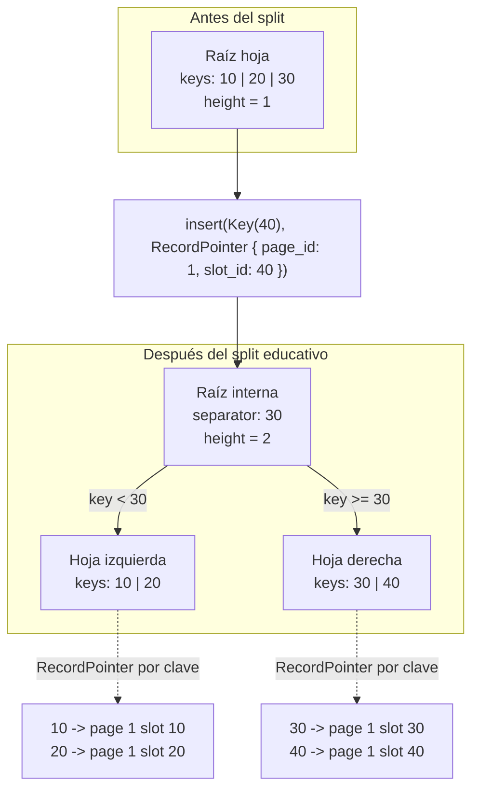

# B-Tree

> **Estado:** borrador técnico de invariantes.
> **Alcance actual:** representación, orden, fanout, altura, claves
> separadoras, punteros, complejidad y modos de falla del modelo educativo.

## Por Qué Existe

Un B-Tree existe porque un índice no puede depender de buscar fila por fila.
Cuando un conjunto de datos crece, recorrerlo completo deja de ser una
operación razonable para cada consulta.

La idea central es agrupar muchas claves por nodo para que cada lectura descarte
grandes regiones del espacio de búsqueda. En motores reales, esos nodos suelen
mapearse a páginas. En este curso, el modelo empieza en memoria para aislar el
mecanismo antes de mezclar páginas, cachés, WAL, recovery o concurrencia.

## Modelo Actual Del Curso

El modelo Rust actual representa un B-Tree educativo con dos formas de raíz:

- raíz como hoja;
- raíz interna con dos hojas después del primer split.

Esta representación alcanza para enseñar el primer momento importante del
árbol: una raíz hoja se llena, se parte en dos hojas y promueve una clave
separadora.

No es todavía un B-Tree completo de producción. El split recursivo, la
eliminación, las páginas persistentes y la concurrencia quedan fuera de este
paso.

## Diagrama Del Split

Fuente Mermaid: [`../diagrams/01-btree.mmd`](../diagrams/01-btree.mmd).



## Ejemplos Progresivos

Los ejemplos del capítulo viven en `examples/` y se pueden ejecutar con
`cargo run --example <nombre>`.

| Ejemplo | Propósito |
|---------|-----------|
| `btree_basic` | Crear un árbol vacío y buscar una clave ausente. |
| `btree_intermediate` | Insertar una clave y recuperar su `RecordPointer`. |
| `btree_advanced` | Forzar el primer split de raíz y observar hojas. |
| `btree_real_case` | Modelar un índice por primary key sobre registros. |

Estos ejemplos no reemplazan las pruebas. Su función es contar la historia del
mecanismo paso a paso, con nombres más cercanos al uso de un índice.

## Invariantes De Orden

Toda hoja conserva sus claves en orden estrictamente ascendente.

Esto garantiza que `search` pueda usar búsqueda binaria dentro de una hoja y
que una clave tenga una única posición posible. Si las claves no estuvieran
ordenadas, el árbol podría devolver falsos negativos: una clave existiría, pero
la búsqueda podría concluir que no está.

Reglas actuales:

- `Key(10)` debe aparecer antes que `Key(20)`.
- Una clave no puede repetirse dentro del árbol.
- Insertar una clave duplicada devuelve `BTreeError::DuplicateKey`.
- El orden se define únicamente por `Key`, no por `RecordPointer`.

## Fanout

En este modelo, `max_keys_per_node` define cuántas claves puede contener una
hoja antes de requerir un split.

El capítulo usa `max_keys_per_node = 3` en pruebas porque permite observar el
primer split con pocos datos:

1. insertar `10`;
2. insertar `20`;
3. insertar `30`;
4. insertar `40`;
5. partir la raíz hoja en dos hojas.

Después del split, el fanout educativo visible es de dos hijos: una hoja
izquierda y una hoja derecha. En un B-Tree completo, el fanout crecería con más
hijos internos; ese paso se deja fuera para no esconder el mecanismo básico
detrás de una implementación demasiado grande.

## Altura Balanceada

La altura indica cuántos niveles atraviesa una búsqueda.

En el modelo actual:

- un árbol vacío tiene altura `0`;
- una raíz hoja con datos tiene altura `1`;
- una raíz interna con dos hojas tiene altura `2`.

Todas las hojas existentes están a la misma profundidad. Esa es una invariante
central: si una hoja estuviera más profunda que otra, algunas búsquedas pagarían
más pasos que otras y el árbol dejaría de ser balanceado.

## Claves Separadoras

Cuando la raíz hoja se parte, el modelo promueve la primera clave de la hoja
derecha como clave separadora.

Ejemplo con `max_keys_per_node = 3`:

```text
Antes del split:
raíz hoja: [10, 20, 30]

Insertar 40 produce:
raíz interna: separador 30
hoja izquierda: [10, 20]
hoja derecha:  [30, 40]
```

La regla de búsqueda es:

- si `key < separator`, buscar en la hoja izquierda;
- si `key >= separator`, buscar en la hoja derecha.

Este diseño se parece a una representación educativa de separadores de B+Tree,
porque la clave separadora también permanece en la hoja derecha con su
`RecordPointer`. El capítulo debe explicar esta decisión cuando compare B-Tree
y B+Tree con más detalle.

## Punteros De Registro

`RecordPointer` no es una dirección de memoria. Representa una referencia
lógica a un registro:

```rust
pub struct RecordPointer {
    pub page_id: u64,
    pub slot_id: u16,
}
```

La clave responde "cómo encuentro el registro"; el puntero responde "dónde está
el registro". Separar ambos conceptos evita confundir índice con tabla.

Invariantes actuales:

- cada `Key` insertada tiene exactamente un `RecordPointer`;
- `len` cuenta pares clave-puntero, no nodos;
- un `RecordPointer` puede repetirse en pruebas educativas, pero una clave no;
- `search` devuelve `Ok(Some(pointer))` solo cuando la clave existe;
- `search` devuelve `Ok(None)` cuando la clave no existe.

## Complejidad

En el modelo actual, la complejidad todavía es deliberadamente pequeña:

| Operación | Modelo actual | Intuición |
|-----------|---------------|-----------|
| `search` en árbol vacío | `O(1)` | no hay hojas con datos |
| `search` con raíz hoja | `O(log m)` | búsqueda binaria en una hoja |
| `search` después del primer split | `O(1 + log m)` | elegir hoja y buscar dentro |
| `insert` sin split | `O(m)` | buscar posición y desplazar entradas |
| primer split de raíz | `O(m)` | copiar, insertar y dividir entradas |

`m` es el número máximo de claves por hoja. En motores reales, `m` suele ser
grande porque una página puede contener muchas claves. Por eso reducir altura
es más importante que eliminar cada desplazamiento local.

## Modos De Falla

El modelo no debe fallar con pánico en casos esperados. Los errores forman parte
del contrato educativo.

Errores actuales:

- `InvalidMaxKeysPerNode`: la capacidad elegida no permite enseñar splits
  útiles.
- `DuplicateKey`: la clave ya existe y el capítulo aún no modela índices no
  únicos.
- `NodeFullRequiresSplit`: una hoja posterior al primer split se llenó y el
  modelo todavía no implementa split recursivo.
- `MissingNode`: reservado para representaciones con identificadores de nodo.
- `InvariantViolation`: reservado para validación interna y ejercicios de
  corrupción controlada.

## Límites Declarados

Este capítulo todavía no modela:

- eliminación;
- recorridos por rango;
- claves duplicadas;
- redistribución entre hermanos;
- merge de nodos;
- split recursivo;
- páginas persistentes;
- WAL;
- recovery;
- concurrencia.

Nombrar estos límites es parte del diseño. El curso enseña un mecanismo a la
vez para que cada garantía pueda verificarse con pruebas pequeñas.

## Relación Con Motores Reales

PostgreSQL, MySQL y SQLite usan árboles balanceados o variantes cercanas para
índices. Este repositorio no intenta copiar su implementación. El objetivo es
construir una representación mínima que permita razonar sobre las mismas
preguntas:

- ¿cómo se mantiene el orden?;
- ¿cuándo crece la altura?;
- ¿qué significa una clave separadora?;
- ¿qué apunta realmente un índice?;
- ¿qué falla cuando una página o nodo se llena?

La práctica con motores reales pertenece a la secuela `rust-database-systems`.
Aquí el canon es el mecanismo interno explicado con Rust pequeño, pruebas e
invariantes explícitas.
