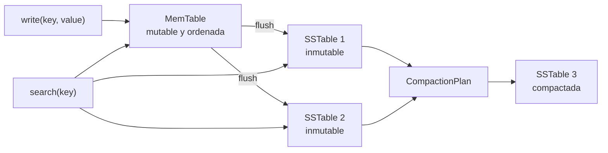

# LSM Tree

> **Estado:** benchmarked.
> **Alcance actual:** `MemTable`, `SSTable`, `SegmentId`,
> `CompactionPlan`, escritura en memoria, flush, búsqueda por precedencia,
> compaction educativa, comparación contra B-Tree, ejemplos, ejercicios,
> soluciones, diagrama Mermaid y benchmark manual.

## Por qué existe

Una LSM Tree existe porque no todos los índices deben optimizar primero la
lectura puntual. Hay cargas donde el costo dominante es escribir muchísimo, de
forma sostenida, sin convertir cada inserción en una actualización aleatoria de
páginas persistentes.

La idea central es aceptar escrituras recientes en memoria, congelarlas en
segmentos ordenados e inmutables y compactar esos segmentos después. El sistema
cambia el costo inmediato de escribir por un costo diferido de mantenimiento.
Ese intercambio es el corazón del capítulo.

B-Tree enseña cómo mantener una estructura ordenada y balanceada mientras se
inserta. LSM Tree enseña otra pregunta: qué pasa si primero escribimos rápido,
dejamos evidencia inmutable y reparamos la forma del índice por lotes.

## Modelo actual del curso

El modelo Rust actual representa una LSM Tree educativa con cuatro piezas:

- `MemTable`: tabla mutable en memoria donde aterrizan las escrituras
  recientes;
- `SSTable`: segmento ordenado e inmutable producido por flush o compaction;
- `SegmentId`: identidad lógica de un segmento;
- `CompactionPlan`: intención explícita de fusionar segmentos y producir uno
  nuevo.

La búsqueda revisa primero la `MemTable` y después recorre los segmentos desde
el más reciente hasta el más antiguo. Esa precedencia importa porque una misma
clave puede aparecer en varios lugares con versiones distintas.

La compaction educativa fusiona segmentos existentes, conserva la versión más
reciente de cada clave y descarta versiones viejas. El resultado es una nueva
`SSTable` ordenada por clave. Los segmentos que no participan en el plan se
mantienen intactos.

No es todavía una LSM Tree de producción. Tombstones, niveles, bloom filters,
índices por bloque, tamaños de página, archivos reales, WAL, concurrencia,
políticas de compaction y recovery quedan para pasos posteriores.

## Diagrama mental



Diagrama fuente: `diagrams/02-lsm-tree.mmd`.

## Costos y decisiones frente a B-Tree

| Decisión | B-Tree | LSM Tree |
|----------|--------|----------|
| Escritura | Inserta dentro de la estructura principal. | Escribe primero en memoria y difiere el orden global. |
| Lectura puntual | Busca por altura balanceada y pocas ramas. | Revisa MemTable y puede revisar varios segmentos. |
| Orden | Se mantiene durante cada operación. | Se mantiene por segmento; el orden global se recompone por compaction. |
| Mutabilidad | Actualiza nodos existentes. | Produce segmentos inmutables y reemplaza por lotes. |
| Costo diferido | Split y rebalanceo cuando un nodo se llena. | Flush y compaction cuando se acumulan segmentos. |
| Amplificación | Puede pagar escrituras aleatorias. | Puede pagar reescrituras durante compaction. |
| Simplicidad de lectura | La ruta de lectura es directa. | La ruta de lectura necesita precedencia entre versiones. |
| Simplicidad de escritura | La inserción toca la estructura ordenada. | La escritura reciente es barata mientras cabe en MemTable. |

La comparación no dice que una estructura sea "mejor" de forma absoluta. Dice
qué costo decide pagar cada una y en qué momento.

## Costo de escritura

En un B-Tree, insertar significa ubicar la hoja correcta, modificarla y partir
nodos cuando se llenan. El beneficio es que la estructura queda lista para
buscar con una ruta balanceada.

En una LSM Tree, escribir en la `MemTable` es barato porque ocurre en memoria y
usa una estructura ordenada local. Cuando la `MemTable` se llena, el sistema
hace flush y produce una `SSTable` inmutable. Esa decisión favorece cargas con
muchas escrituras consecutivas.

El costo no desaparece. Se mueve. Más tarde, compaction tendrá que leer varios
segmentos, fusionarlos y escribir un segmento nuevo. Ese trabajo de fondo es el
precio de haber aceptado escrituras rápidas al inicio.

## Costo de lectura

En un B-Tree, una búsqueda baja por niveles hasta una hoja. La altura crece
lento porque cada nodo agrupa muchas claves. La lectura puntual suele tener una
ruta clara: nodo raíz, nodos internos, hoja.

En una LSM Tree, una búsqueda debe respetar versiones. Primero revisa memoria,
luego segmentos recientes y después segmentos antiguos. Si la clave aparece en
varios segmentos, gana la versión más reciente.

Sin ayudas adicionales, demasiados segmentos elevan el costo de lectura. Por
eso las LSM Tree reales combinan compaction, bloom filters, índices por bloque y
cachés. El modelo educativo empieza sin esas optimizaciones para que la
precedencia sea visible.

## Compaction como mantenimiento

Compaction no es una limpieza cosmética. Es la operación que reduce deuda
estructural:

- junta segmentos que antes estaban separados;
- elimina versiones viejas que ya no son visibles;
- mantiene el orden por clave en el nuevo segmento;
- reduce la cantidad de lugares que una búsqueda debe consultar;
- prepara el terreno para políticas por niveles o tamaños.

En este repo, `CompactionPlan` es explícito porque el curso quiere enseñar que
la compaction es una decisión del sistema, no un efecto mágico de escribir. El
plan dice qué segmentos se leen y cuál será el segmento de salida.

## Invariantes del modelo

- Una `MemTable` necesita capacidad positiva.
- Una escritura nueva consume una entrada de la `MemTable`.
- Reescribir una clave existente no aumenta `len`.
- Un flush vacío falla.
- Un flush con datos crea una `SSTable` ordenada y vacía la `MemTable`.
- Una búsqueda revisa memoria antes que segmentos.
- Entre segmentos, una búsqueda revisa de más reciente a más antiguo.
- Una compaction necesita entradas existentes.
- Una compaction no puede reutilizar un segmento existente como salida.
- Una compaction conserva la versión más reciente de cada clave compactada.
- Una compaction no modifica segmentos fuera del plan.

Estas reglas están escritas para que el lector pueda comparar representación,
operaciones y errores sin saltar todavía a archivos reales.

## Cuándo preferir cada modelo

Un B-Tree suele ser una buena intuición inicial cuando:

- las lecturas puntuales son frecuentes;
- las escrituras deben dejar la estructura principal lista de inmediato;
- importa mantener una sola ruta clara hacia cada clave;
- el costo de actualización en sitio es aceptable.

Una LSM Tree suele ser una buena intuición inicial cuando:

- hay muchas escrituras sostenidas;
- conviene convertir escrituras aleatorias en escrituras por lotes;
- se acepta hacer mantenimiento de fondo;
- el sistema puede compensar lecturas con filtros, cachés y compaction.

Estas son intuiciones de diseño, no recetas. Un motor real mezcla muchas capas:
WAL, buffer pool, compresión, concurrencia, recovery, estadísticas y decisiones
de almacenamiento físico.

## Relación con el resto del curso

LSM Tree conecta con capítulos posteriores:

- índices, porque una SSTable necesita estructuras auxiliares para buscar
  rápido;
- transacciones y ACID, porque las versiones visibles deben respetar reglas de
  consistencia;
- MVCC, porque conservar o descartar versiones deja de ser trivial cuando hay
  lectores concurrentes;
- WAL y recovery, porque aceptar escrituras en memoria exige poder recuperarlas;
- query optimizer, porque el costo de leer varios segmentos cambia la estimación
  de planes.

El propósito de este capítulo no es copiar RocksDB ni LevelDB. El propósito es
construir una maqueta pequeña y honesta para entender por qué esos motores
existen y qué problema decidieron pagar.

## Ejemplos progresivos

Los ejemplos del capítulo viven en `examples/` y se pueden ejecutar con
`cargo run --example <nombre>`.

| Ejemplo | Propósito |
|---------|-----------|
| `lsm_tree_basic` | Escribir en MemTable y leer una clave reciente. |
| `lsm_tree_intermediate` | Mostrar precedencia de MemTable sobre SSTable. |
| `lsm_tree_advanced` | Compactar segmentos y conservar versiones visibles. |

## Ejercicios

Los ejercicios están graduados para practicar una idea por vez. Las soluciones
ejecutables viven en `examples/soluciones/`.

### Nivel 1: Flush a SSTable

Objetivo: observar cómo una MemTable ordenada se congela en un segmento
inmutable.

Tareas:

- crear una `MemTable` con capacidad positiva;
- escribir claves fuera de orden;
- ejecutar `flush_to_sstable`;
- confirmar que la MemTable queda vacía;
- confirmar que la SSTable conserva entradas ordenadas.

Solución: `cargo run --example lsm_tree_flush`.

### Nivel 2: Precedencia de lectura

Objetivo: comprobar que la versión más reciente gana durante una búsqueda.

Tareas:

- escribir una clave y hacer flush a `SSTable`;
- escribir la misma clave otra vez en MemTable;
- buscar la clave;
- confirmar que el valor visible es el de MemTable.

Solución: `cargo run --example lsm_tree_precedence`.

### Nivel 3: Compaction

Objetivo: fusionar segmentos y conservar la versión visible más reciente.

Tareas:

- crear dos segmentos con una clave repetida;
- crear un `CompactionPlan`;
- ejecutar `compact`;
- confirmar que queda un segmento nuevo;
- confirmar que la clave repetida conserva el valor más reciente.

Solución: `cargo run --example lsm_tree_compaction`.

## Benchmark manual

El benchmark del capítulo mide escritura en MemTable, búsqueda con segmentos,
flush y compaction:

```bash
cargo bench --bench lsm_tree_bench
```

La medición no pretende evaluar RocksDB, LevelDB ni un motor de producción.
Sirve para conectar operaciones del modelo educativo con tiempos observables y
comparables dentro del mismo crate.

## Lo que aún no hace

Este capítulo todavía no decide:

- tombstones para borrado;
- niveles y políticas de compaction;
- bloom filters;
- índices por bloque;
- archivos reales en disco;
- integración con WAL, recovery, MVCC o concurrencia.

## Siguiente paso natural

El siguiente paso natural del repo es corregir la marca pendiente de Índices en
el checklist general o crear el siguiente issue de trazabilidad que mantenga el
tablero de GitHub alineado con el estado real del curso.
