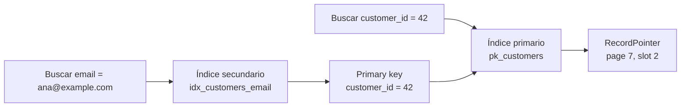

# Índices

> **Estado:** benchmarked.
> **Alcance actual:** índice primario, índice secundario, nombres de índice,
> nombres de columna, rol del índice, destino lógico de búsqueda, índice único
> e índice no único, selectividad, estimación de candidatos, costos,
> ejemplos, ejercicios y benchmark manual.

## Por Qué Existe

Un índice existe porque una tabla completa rara vez es la mejor respuesta para
cada consulta. Si una consulta pregunta por una clave concreta, recorrer todos
los registros convierte el tamaño de la tabla en el costo dominante.

El capítulo separa dos preguntas que suelen confundirse:

- cómo encuentro la fila que define la identidad del registro;
- cómo encuentro esa misma fila desde otra columna de búsqueda.

La primera pregunta corresponde al índice primario. La segunda corresponde al
índice secundario.

## Modelo Actual Del Curso

El modelo Rust actual define `IndexDefinition` como una descripción declarativa
de un índice. Todavía no almacena entradas ni ejecuta búsquedas; primero fija el
vocabulario para que las operaciones posteriores no mezclen responsabilidades.

Piezas actuales:

- `IndexName`: nombre lógico del índice;
- `ColumnName`: columna usada por la llave de búsqueda;
- `IndexRole`: distingue `Primary` y `Secondary`;
- `IndexUniqueness`: distingue `Unique` y `NonUnique`;
- `IndexTarget`: explica hacia dónde apunta el índice;
- `IndexEntries`: modela entradas de índice y reglas de duplicado;
- `Selectivity`: resume cuántas llaves distintas existen frente a cuántas
  filas indexadas;
- `SelectivityClass`: clasifica esa proporción como `Empty`, `High`, `Medium`
  o `Low`;
- `IndexDefinition`: une nombre, rol, columnas y destino.

Un índice primario apunta a `IndexTarget::RecordPointer`, porque su búsqueda
resuelve directamente la ubicación lógica del registro.

Un índice secundario apunta a `IndexTarget::PrimaryKey`, porque su búsqueda no
debe duplicar la identidad física de la fila. Primero encuentra la primary key y
después esa clave permite llegar al registro por el camino canónico.

Un índice primario se declara `Unique` porque la primary key identifica una fila
canónica. Un índice secundario puede ser `Unique`, como un correo electrónico,
o `NonUnique`, como país, ciudad o estado.

## Índice Primario

Un índice primario define la identidad principal de una fila. En un motor real,
esa identidad puede coincidir con el orden físico de almacenamiento o puede ser
una estructura separada; el punto educativo inicial es más pequeño: la primary
key responde "qué fila es".

Ejemplo conceptual:

```text
pk_customers(customer_id) -> RecordPointer

customer_id = 42 -> page 7, slot 2
```

El índice primario es el camino canónico porque no depende de otra columna para
resolver la fila.

## Índice Secundario

Un índice secundario existe para buscar por otra columna.

Ejemplo conceptual:

```text
idx_customers_email(email) -> customer_id

email = "ana@example.com" -> customer_id = 42
customer_id = 42 -> page 7, slot 2
```

La segunda línea muestra por qué el índice secundario no reemplaza al primario:
su resultado necesita volver a la identidad principal. Esto mantiene separada
la pregunta "por qué campo busco" de la pregunta "dónde está la fila".

## Índice Único Y No Único

La unicidad es una regla sobre la llave del índice.

En un índice único, una llave de índice puede apuntar a una sola primary key:

```text
email = "ana@example.com" -> customer_id = 42
email = "ana@example.com" -> customer_id = 99  // error
```

El error existe porque el índice promete que ese valor identifica a lo mucho una
fila visible.

En un índice no único, una llave de índice puede apuntar a varias primary keys:

```text
country = "MX" -> customer_id = 42
country = "MX" -> customer_id = 99
country = "MX" -> customer_id = 123
```

Este caso es común en columnas de clasificación. La búsqueda por país no
identifica una sola fila; devuelve un conjunto de candidatos.

## Selectividad

La selectividad mide qué tanto reduce candidatos un índice.

En este modelo educativo:

```text
selectividad = llaves_distintas / filas_indexadas
```

Un índice único con una llave distinta por fila tiene selectividad alta:

```text
customer_id = 1 -> 1
customer_id = 2 -> 2

llaves_distintas = 2
filas_indexadas = 2
selectividad = 1.0
```

Un índice no único con valores repetidos reduce menos:

```text
country = "MX" -> 1, 2
country = "US" -> 3, 4

llaves_distintas = 2
filas_indexadas = 4
selectividad = 0.5
```

La selectividad no ejecuta una consulta por sí sola. Ayuda a estimar cuántas
filas candidatas quedan después de usar el índice. Si una llave apunta a muchas
primary keys, el motor todavía tendrá bastante trabajo posterior.

## Costo De Lectura

El costo de lectura de un índice depende de dos momentos:

- encontrar la llave dentro de la estructura del índice;
- seguir el resultado hacia las filas candidatas.

En un índice primario, la búsqueda apunta al registro canónico. Conceptualmente:

```text
customer_id = 42 -> RecordPointer
```

En un índice secundario, la búsqueda puede necesitar un paso adicional:

```text
email = "ana@example.com" -> customer_id = 42
customer_id = 42 -> RecordPointer
```

Cuando la selectividad es alta, el índice deja pocos candidatos. Cuando la
selectividad es baja, el índice puede encontrar la llave rápido y aun así dejar
muchas filas por revisar.

## Costo De Escritura

Un índice acelera algunas lecturas, pero cada escritura debe mantenerlo.

Insertar una fila sin índices solo actualiza la tabla. Insertar una fila con
varios índices implica actualizar cada camino de acceso:

```text
insert customer
  -> escribir fila
  -> actualizar pk_customers(customer_id)
  -> actualizar uq_customers_email(email)
  -> actualizar idx_customers_country(country)
```

El costo crece con el número de índices y con las reglas que cada uno exige. Un
índice único debe revisar duplicados antes de aceptar la llave. Un índice no
único debe agregar otra primary key al conjunto de candidatos.

## Costo De Mantenimiento

El mantenimiento no termina después del `insert`.

Un `update` puede requerir borrar una entrada antigua y escribir una nueva si
cambia la columna indexada:

```text
country: "MX" -> "US"
  -> quitar customer_id de idx_country("MX")
  -> agregar customer_id a idx_country("US")
```

Un `delete` debe retirar la fila de cada índice afectado. En motores reales,
esas operaciones conviven con páginas, bloqueos, WAL, MVCC y recovery. Este
modelo todavía no implementa esas capas, pero sí deja visible la idea central:
cada índice adicional reduce ciertos costos de lectura a cambio de más trabajo
de escritura y mantenimiento.

## Ejemplos Progresivos

Los ejemplos del capítulo viven en `examples/` y se pueden ejecutar con
`cargo run --example <nombre>`.

| Ejemplo | Propósito |
|---------|-----------|
| `indexes_basic` | Declarar un índice primario y leer su llave canónica. |
| `indexes_intermediate` | Modelar un índice no único con varios candidatos. |
| `indexes_advanced` | Calcular selectividad baja y estimar candidatos. |

Estos ejemplos cuentan la historia del capítulo sin mezclar todavía B-Tree,
LSM Tree, WAL ni transacciones.

## Ejercicios

Los ejercicios están graduados para practicar una idea por vez. Las soluciones
ejecutables viven en `examples/soluciones/`.

### Nivel 1: Índice Único

Objetivo: observar que una llave repetida viola la promesa de unicidad.

Tareas:

- crear un `IndexEntries` con `IndexUniqueness::Unique`;
- insertar `ana@example.com -> customer-1001`;
- intentar insertar `ana@example.com -> customer-1002`;
- confirmar que el resultado es `IndexError::DuplicateIndexKey`.

Solución: `cargo run --example indexes_unique`.

### Nivel 2: Selectividad

Objetivo: calcular cuántas llaves distintas existen frente a las filas
indexadas.

Tareas:

- crear un índice no único para `country`;
- insertar dos clientes de `MX` y uno de `US`;
- calcular `selectivity`;
- confirmar `distinct_keys = 2` e `indexed_rows = 3`;
- explicar por qué la clase resultante no es `High`.

Solución: `cargo run --example indexes_selectivity`.

### Nivel 3: Costo De Mantenimiento

Objetivo: razonar, sin codificar todavía un motor completo, qué cambia cuando
una tabla tiene varios índices.

Tareas:

- listar tres índices para una tabla `customers`;
- indicar qué índices se actualizan al insertar una fila nueva;
- indicar qué índices se actualizan si cambia `email`;
- indicar qué índices se actualizan si cambia `country`;
- explicar cuál de esos índices agrega validación de duplicados.

Este ejercicio es deliberadamente conceptual. Su solución esperada es una tabla
de razonamiento sobre qué índices se tocan.

Solución: `cargo run --example indexes_maintenance`.

## Benchmark Manual

El benchmark educativo vive en `benches/indexes_bench.rs` y se ejecuta con:

```bash
cargo bench --bench indexes_bench
```

Mide tres operaciones pequeñas:

- inserción en un índice único;
- lookup en un índice no único;
- cálculo de selectividad.

El objetivo no es competir con motores reales. El objetivo es hacer visible que
un índice no único puede devolver muchos candidatos y que calcular estadísticas
también tiene costo.

## Diagrama Mental



## Invariantes Del Modelo

- Un `IndexName` no puede estar vacío.
- Un `ColumnName` no puede estar vacío.
- Un índice primario tiene rol `Primary`.
- Un índice primario resuelve hacia `RecordPointer`.
- Un índice primario se declara `Unique`.
- Un índice secundario tiene rol `Secondary`.
- Un índice secundario resuelve hacia la columna de primary key.
- Un índice secundario puede declararse `Unique` o `NonUnique`.
- Un `IndexEntries` único rechaza una llave repetida.
- Un `IndexEntries` no único permite varias primary keys para la misma llave.
- Buscar una llave ausente devuelve un conjunto vacío de primary keys.
- `Selectivity::ratio` devuelve `0.0` cuando el índice está vacío.
- La selectividad se calcula como llaves distintas entre filas indexadas.
- `estimated_candidates_for` devuelve cuántas primary keys existen para una
  llave.
- Un índice adicional reduce algunos caminos de lectura, pero agrega trabajo a
  escrituras y mantenimiento.

## Lo Que Todavía No Modela

Este modelo todavía no implementa:

- uso de B-Tree o LSM Tree como estructura física;
- interacción con transacciones, MVCC o WAL.

Dejar esas piezas fuera hace que el lector vea primero la forma conceptual del
índice. Los siguientes issues agregan comportamiento sin cambiar este lenguaje
base.

## Relación Con B-Tree Y LSM Tree

B-Tree y LSM Tree son formas posibles de organizar un índice. El capítulo de
Índices pregunta algo más general: qué significa tener un camino de acceso
alternativo hacia los datos.

Un B-Tree puede implementar un índice primario o secundario. Una LSM Tree
también puede hacerlo. La diferencia entre primario y secundario no está en la
estructura física, sino en el papel que cumple dentro del modelo de datos.

Esta separación prepara el terreno para discutir costo de lectura, escritura y
mantenimiento sin confundir "estructura de datos" con "contrato de consulta".
