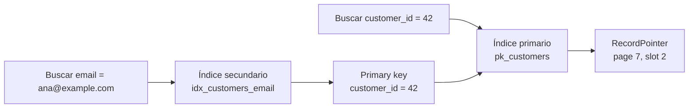

# Índices

> **Estado:** borrador técnico de representación.
> **Alcance actual:** índice primario, índice secundario, nombres de índice,
> nombres de columna, rol del índice y destino lógico de búsqueda.

## Por Qué Existe

Un índice existe porque una tabla completa rara vez es la mejor respuesta para
cada consulta. Si una consulta pregunta por una clave concreta, recorrer todos
los registros convierte el tamaño de la tabla en el costo dominante.

El capítulo separa dos preguntas que suelen confundirse:

- cómo encuentro la fila que define la identidad del registro;
- cómo encuentro esa misma fila desde otra columna de búsqueda.

La primera pregunta corresponde al índice primario. La segunda corresponde al
índice secundario.

## Modelo Actual Del Curso

El modelo Rust actual define `IndexDefinition` como una descripción declarativa
de un índice. Todavía no almacena entradas ni ejecuta búsquedas; primero fija el
vocabulario para que las operaciones posteriores no mezclen responsabilidades.

Piezas actuales:

- `IndexName`: nombre lógico del índice;
- `ColumnName`: columna usada por la llave de búsqueda;
- `IndexRole`: distingue `Primary` y `Secondary`;
- `IndexTarget`: explica hacia dónde apunta el índice;
- `IndexDefinition`: une nombre, rol, columnas y destino.

Un índice primario apunta a `IndexTarget::RecordPointer`, porque su búsqueda
resuelve directamente la ubicación lógica del registro.

Un índice secundario apunta a `IndexTarget::PrimaryKey`, porque su búsqueda no
debe duplicar la identidad física de la fila. Primero encuentra la primary key y
después esa clave permite llegar al registro por el camino canónico.

## Índice Primario

Un índice primario define la identidad principal de una fila. En un motor real,
esa identidad puede coincidir con el orden físico de almacenamiento o puede ser
una estructura separada; el punto educativo inicial es más pequeño: la primary
key responde "qué fila es".

Ejemplo conceptual:

```text
pk_customers(customer_id) -> RecordPointer

customer_id = 42 -> page 7, slot 2
```

El índice primario es el camino canónico porque no depende de otra columna para
resolver la fila.

## Índice Secundario

Un índice secundario existe para buscar por otra columna.

Ejemplo conceptual:

```text
idx_customers_email(email) -> customer_id

email = "ana@example.com" -> customer_id = 42
customer_id = 42 -> page 7, slot 2
```

La segunda línea muestra por qué el índice secundario no reemplaza al primario:
su resultado necesita volver a la identidad principal. Esto mantiene separada
la pregunta "por qué campo busco" de la pregunta "dónde está la fila".

## Diagrama Mental



## Invariantes Del Modelo

- Un `IndexName` no puede estar vacío.
- Un `ColumnName` no puede estar vacío.
- Un índice primario tiene rol `Primary`.
- Un índice primario resuelve hacia `RecordPointer`.
- Un índice secundario tiene rol `Secondary`.
- Un índice secundario resuelve hacia la columna de primary key.
- La definición del índice no decide todavía unicidad, selectividad ni costo.

## Lo Que Todavía No Modela

Este primer paso no implementa:

- entradas dentro del índice;
- índices únicos y no únicos;
- duplicados en índices secundarios;
- selectividad;
- costo de mantenimiento al escribir;
- uso de B-Tree o LSM Tree como estructura física;
- interacción con transacciones, MVCC o WAL.

Dejar esas piezas fuera hace que el lector vea primero la forma conceptual del
índice. Los siguientes issues agregan comportamiento sin cambiar este lenguaje
base.

## Relación Con B-Tree Y LSM Tree

B-Tree y LSM Tree son formas posibles de organizar un índice. El capítulo de
Índices pregunta algo más general: qué significa tener un camino de acceso
alternativo hacia los datos.

Un B-Tree puede implementar un índice primario o secundario. Una LSM Tree
también puede hacerlo. La diferencia entre primario y secundario no está en la
estructura física, sino en el papel que cumple dentro del modelo de datos.

Esta separación prepara el terreno para discutir costo de lectura, escritura y
mantenimiento sin confundir "estructura de datos" con "contrato de consulta".
