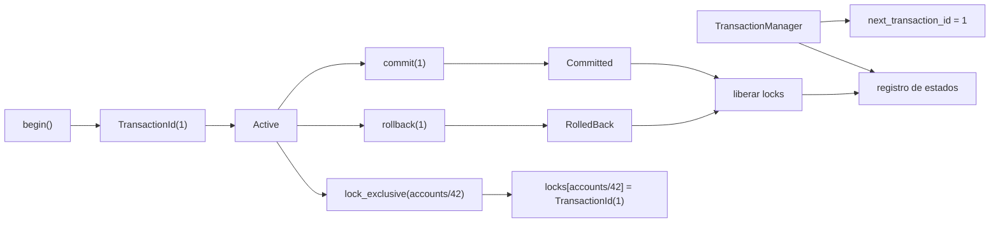

# Transacciones

> **Estado:** borrador técnico de ciclo de vida.
> **Alcance actual:** `TransactionId`, `TransactionState`,
> `TransactionManager`, registro explícito de estado inicial, `begin`, `commit`,
> `rollback`, validación de transiciones, `ResourceId` y locks exclusivos
> educativos.

## Por Qué Existe

Una transacción existe porque una base de datos no solo guarda valores: debe
proteger unidades de trabajo. Un pago, una reserva o una transferencia no son
una lista de escrituras sueltas; son una intención que debe terminar de forma
coherente.

Antes de hablar de atomicidad, aislamiento o recovery, el curso necesita fijar
el vocabulario mínimo:

- qué identifica una transacción;
- en qué estado está;
- quién registra ese estado.

Este capítulo empieza ahí. Las operaciones `begin`, `commit` y `rollback`
modelan el ciclo mínimo. Los conflictos simples se representan con un lock
exclusivo por recurso lógico.

## Modelo Actual Del Curso

El modelo Rust actual define cuatro piezas:

- `TransactionId`: identificador lógico de una transacción;
- `TransactionState`: estado visible (`Active`, `Committed`, `RolledBack`);
- `ResourceId`: recurso lógico protegido por una transacción;
- `TransactionManager`: registro educativo de transacciones conocidas.

`TransactionManager::new` crea un administrador vacío. El primer
`TransactionId` disponible es `1`. Registrar una transacción avanza el siguiente
identificador y permite consultar el estado asociado.

`TransactionManager::begin` abre una transacción en estado `Active`.
`TransactionManager::commit` cierra una transacción activa en estado
`Committed`. `TransactionManager::rollback` cierra una transacción activa en
estado `RolledBack`.

`TransactionManager::lock_exclusive` permite que una transacción activa reserve
un `ResourceId`. Si otra transacción activa intenta reservar el mismo recurso,
el administrador devuelve `TransactionError::ResourceConflict`.

## Estados

Los estados actuales nombran el ciclo de vida mínimo:

| Estado | Significado |
|--------|-------------|
| `Active` | La transacción está abierta y puede recibir trabajo. |
| `Committed` | La transacción terminó aceptando sus cambios. |
| `RolledBack` | La transacción terminó descartando sus cambios. |

`Committed` y `RolledBack` son estados terminales. Una vez que una transacción
termina, no puede volver a cerrarse ni regresar a `Active`.

## Transiciones

| Operación | Estado inicial permitido | Estado final |
|-----------|--------------------------|--------------|
| `begin` | no aplica | `Active` |
| `commit` | `Active` | `Committed` |
| `rollback` | `Active` | `RolledBack` |

Si la transacción no existe, `commit` y `rollback` devuelven
`TransactionError::UnknownTransaction`. Si la transacción existe, pero ya está
cerrada, devuelven `TransactionError::InvalidStateTransition`.

Al hacer `commit` o `rollback`, el administrador libera todos los locks que
pertenecen a esa transacción. Así, otra transacción activa puede continuar el
trabajo sobre el mismo recurso.

## Conflictos Simples

Un conflicto simple aparece cuando dos transacciones activas quieren el mismo
recurso exclusivo al mismo tiempo.

Ejemplo conceptual:

1. `T1` abre una transacción.
2. `T1` toma el recurso `accounts/42`.
3. `T2` abre otra transacción.
4. `T2` intenta tomar `accounts/42`.
5. El administrador responde con `ResourceConflict`.

Este modelo todavía no decide si `T2` debe esperar, abortar, reintentar o entrar
a una cola. Solo nombra el conflicto y conserva quién mantiene el recurso.

## Diagrama Mental

## Invariantes Del Modelo

- `TransactionId` expone un valor lógico estable.
- `TransactionManager` inicia vacío.
- El primer identificador disponible es `TransactionId(1)`.
- Registrar una transacción devuelve el identificador asignado.
- Registrar una transacción incrementa el siguiente identificador.
- `begin` registra una transacción activa.
- `commit` solo acepta transacciones activas.
- `rollback` solo acepta transacciones activas.
- `Committed` y `RolledBack` son estados terminales.
- `ResourceId` rechaza nombres vacíos.
- Una transacción activa puede tomar un lock exclusivo sobre un recurso libre.
- Tomar dos veces el mismo recurso desde la misma transacción es idempotente.
- Dos transacciones activas no pueden mantener el mismo recurso exclusivo.
- `commit` y `rollback` liberan los locks de la transacción cerrada.
- Consultar una transacción inexistente devuelve `None`.
- Intentar cerrar una transacción inexistente devuelve
  `TransactionError::UnknownTransaction`.
- Intentar cerrar una transacción terminal devuelve
  `TransactionError::InvalidStateTransition`.
- Intentar operar con locks desde una transacción cerrada devuelve
  `TransactionError::InactiveTransaction`.
- Intentar tomar un recurso ocupado por otra transacción devuelve
  `TransactionError::ResourceConflict`.
- `TransactionState::as_str` devuelve un nombre estable para documentación y
  ejemplos.

## Lo Que Todavía No Modela

Este modelo todavía no implementa:

- locks compartidos;
- espera, timeouts, deadlocks o detección de ciclos;
- aislamiento;
- WAL, recovery o durabilidad.

La frontera es deliberada. Primero se nombra el sistema; después se agregan
propiedades transaccionales más fuertes.
