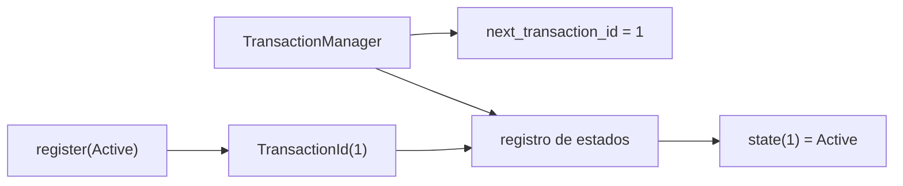

# Transacciones

> **Estado:** borrador técnico de representación.
> **Alcance actual:** `TransactionId`, `TransactionState`,
> `TransactionManager`, registro explícito de estado inicial y consulta de
> estado.

## Por Qué Existe

Una transacción existe porque una base de datos no solo guarda valores: debe
proteger unidades de trabajo. Un pago, una reserva o una transferencia no son
una lista de escrituras sueltas; son una intención que debe terminar de forma
coherente.

Antes de hablar de atomicidad, aislamiento o recovery, el curso necesita fijar
el vocabulario mínimo:

- qué identifica una transacción;
- en qué estado está;
- quién registra ese estado.

Este capítulo empieza ahí. Las operaciones `begin`, `commit`, `rollback` y los
conflictos simples se modelan en los siguientes pasos.

## Modelo Actual Del Curso

El modelo Rust actual define tres piezas:

- `TransactionId`: identificador lógico de una transacción;
- `TransactionState`: estado visible (`Active`, `Committed`, `RolledBack`);
- `TransactionManager`: registro educativo de transacciones conocidas.

`TransactionManager::new` crea un administrador vacío. El primer
`TransactionId` disponible es `1`. Registrar una transacción avanza el siguiente
identificador y permite consultar el estado asociado.

## Estados

Los estados actuales nombran el ciclo de vida mínimo:

| Estado | Significado |
|--------|-------------|
| `Active` | La transacción está abierta y puede recibir trabajo. |
| `Committed` | La transacción terminó aceptando sus cambios. |
| `RolledBack` | La transacción terminó descartando sus cambios. |

Este primer paso todavía no cambia estados automáticamente. La transición entre
ellos pertenece al siguiente issue, donde se modelan `begin`, `commit` y
`rollback`.

## Diagrama Mental

## Invariantes Del Modelo

- `TransactionId` expone un valor lógico estable.
- `TransactionManager` inicia vacío.
- El primer identificador disponible es `TransactionId(1)`.
- Registrar una transacción devuelve el identificador asignado.
- Registrar una transacción incrementa el siguiente identificador.
- Consultar una transacción inexistente devuelve `None`.
- `TransactionState::as_str` devuelve un nombre estable para documentación y
  ejemplos.

## Lo Que Todavía No Modela

Este modelo todavía no implementa:

- `begin`;
- `commit`;
- `rollback`;
- cambios de estado validados;
- conflictos entre transacciones;
- locks;
- aislamiento;
- WAL, recovery o durabilidad.

La frontera es deliberada. Primero se nombra el sistema; después se agregan
transiciones y reglas.
