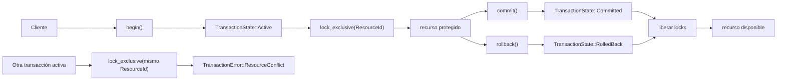

# Transacciones

> **Estado:** benchmarked.
> **Alcance actual:** `TransactionId`, `TransactionState`,
> `TransactionManager`, registro explícito de estado inicial, `begin`, `commit`,
> `rollback`, validación de transiciones, `ResourceId` y locks exclusivos
> educativos, atomicidad, aislamiento, ejemplos, ejercicios y benchmark manual.

## Por Qué Existe

Una transacción existe porque una base de datos no solo guarda valores: debe
proteger unidades de trabajo. Un pago, una reserva o una transferencia no son
una lista de escrituras sueltas; son una intención que debe terminar de forma
coherente.

Antes de hablar de atomicidad, aislamiento o recovery, el curso necesita fijar
el vocabulario mínimo:

- qué identifica una transacción;
- en qué estado está;
- quién registra ese estado.

Este capítulo empieza ahí. Las operaciones `begin`, `commit` y `rollback`
modelan el ciclo mínimo. Los conflictos simples se representan con un lock
exclusivo por recurso lógico.

## Modelo Actual Del Curso

El modelo Rust actual define cuatro piezas:

- `TransactionId`: identificador lógico de una transacción;
- `TransactionState`: estado visible (`Active`, `Committed`, `RolledBack`);
- `ResourceId`: recurso lógico protegido por una transacción;
- `TransactionManager`: registro educativo de transacciones conocidas.

`TransactionManager::new` crea un administrador vacío. El primer
`TransactionId` disponible es `1`. Registrar una transacción avanza el siguiente
identificador y permite consultar el estado asociado.

`TransactionManager::begin` abre una transacción en estado `Active`.
`TransactionManager::commit` cierra una transacción activa en estado
`Committed`. `TransactionManager::rollback` cierra una transacción activa en
estado `RolledBack`.

`TransactionManager::lock_exclusive` permite que una transacción activa reserve
un `ResourceId`. Si otra transacción activa intenta reservar el mismo recurso,
el administrador devuelve `TransactionError::ResourceConflict`.

## Estados

Los estados actuales nombran el ciclo de vida mínimo:

| Estado | Significado |
|--------|-------------|
| `Active` | La transacción está abierta y puede recibir trabajo. |
| `Committed` | La transacción terminó aceptando sus cambios. |
| `RolledBack` | La transacción terminó descartando sus cambios. |

`Committed` y `RolledBack` son estados terminales. Una vez que una transacción
termina, no puede volver a cerrarse ni regresar a `Active`.

## Transiciones

| Operación | Estado inicial permitido | Estado final |
|-----------|--------------------------|--------------|
| `begin` | no aplica | `Active` |
| `commit` | `Active` | `Committed` |
| `rollback` | `Active` | `RolledBack` |

Si la transacción no existe, `commit` y `rollback` devuelven
`TransactionError::UnknownTransaction`. Si la transacción existe, pero ya está
cerrada, devuelven `TransactionError::InvalidStateTransition`.

Al hacer `commit` o `rollback`, el administrador libera todos los locks que
pertenecen a esa transacción. Así, otra transacción activa puede continuar el
trabajo sobre el mismo recurso.

## Conflictos Simples

Un conflicto simple aparece cuando dos transacciones activas quieren el mismo
recurso exclusivo al mismo tiempo.

Ejemplo conceptual:

1. `T1` abre una transacción.
2. `T1` toma el recurso `accounts/42`.
3. `T2` abre otra transacción.
4. `T2` intenta tomar `accounts/42`.
5. El administrador responde con `ResourceConflict`.

Este modelo todavía no decide si `T2` debe esperar, abortar, reintentar o entrar
a una cola. Solo nombra el conflicto y conserva quién mantiene el recurso.

## Atomicidad

Atomicidad significa que una unidad de trabajo termina como una sola intención.
En un motor real, eso implica undo, redo, WAL, páginas sucias, recovery y
decisiones de durabilidad. En este capítulo todavía no existe almacenamiento
persistente, así que la atomicidad se modela en una frontera más pequeña:

- una transacción solo puede estar abierta o cerrada;
- `commit` representa aceptar la intención;
- `rollback` representa descartarla;
- después de cerrar, la transacción no puede volver a cambiar de estado;
- cerrar la transacción libera los recursos que protegía.

Esto no prueba que los datos hayan quedado durables. Sí deja una regla mental
importante: una transacción no es una escritura individual, es el contenedor que
decide si un conjunto de trabajo se acepta o se descarta.

## Aislamiento

Aislamiento significa que una transacción no debe observar o pisar trabajo de
otra transacción de forma incoherente. Este modelo no implementa niveles como
`Read Committed`, `Repeatable Read` o `Serializable`; solo enseña la primera
forma visible de aislamiento: exclusión sobre un recurso lógico.

Cuando `T1` toma `accounts/42`, `T2` no puede tomar ese mismo recurso hasta que
`T1` haga `commit` o `rollback`. El resultado no es una espera automática: el
administrador devuelve `ResourceConflict`. Esa respuesta explícita permite
explicar una decisión de diseño que todo motor debe tomar después:

- bloquear y esperar;
- abortar;
- reintentar;
- ordenar las transacciones;
- cambiar el nivel de aislamiento.

El curso mantiene esa decisión fuera de este capítulo para no ocultar el
mecanismo básico: antes de hablar de políticas, hay que ver el conflicto.

## Ejemplos Progresivos

Los ejemplos del capítulo viven en `examples/` y se pueden ejecutar con
`cargo run --example <nombre>`.

| Ejemplo | Propósito |
|---------|-----------|
| `transactions_basic` | Abrir una transacción y cerrarla con `commit`. |
| `transactions_intermediate` | Mostrar un conflicto por lock exclusivo. |
| `transactions_advanced` | Liberar un recurso con `rollback` y reintentarlo. |

Estos ejemplos no mezclan todavía B-Tree, índices, MVCC ni WAL. El objetivo es
aislar el vocabulario transaccional antes de integrarlo con otras capas.

## Ejercicios

Los ejercicios están graduados para practicar una idea por vez. Las soluciones
ejecutables viven en `examples/soluciones/`.

### Nivel 1: Commit

Objetivo: observar que `commit` cierra una transacción activa.

Tareas:

- crear un `TransactionManager`;
- abrir una transacción con `begin`;
- ejecutar `commit`;
- confirmar que el estado final es `TransactionState::Committed`.

Solución: `cargo run --example transactions_commit`.

### Nivel 2: Conflicto Exclusivo

Objetivo: observar que dos transacciones activas no pueden tomar el mismo
recurso exclusivo.

Tareas:

- abrir dos transacciones;
- crear `ResourceId::new("accounts/42")`;
- tomar el recurso desde la primera transacción;
- intentar tomarlo desde la segunda;
- confirmar que el error es `TransactionError::ResourceConflict`.

Solución: `cargo run --example transactions_conflict`.

### Nivel 3: Aislamiento Mínimo

Objetivo: razonar por qué cerrar una transacción libera sus recursos.

Tareas:

- abrir dos transacciones;
- tomar un recurso desde la primera;
- cerrar la primera con `rollback`;
- tomar el mismo recurso desde la segunda;
- explicar por qué este comportamiento es una forma mínima de aislamiento.

Solución: `cargo run --example transactions_isolation`.

## Benchmark Manual

El benchmark educativo vive en `benches/transactions_bench.rs` y se ejecuta con:

```bash
cargo bench --bench transactions_bench
```

Mide tres operaciones pequeñas:

- abrir y confirmar transacciones;
- tomar locks exclusivos sin conflicto;
- detectar conflictos sobre un recurso caliente.

El objetivo no es competir con un motor real. El objetivo es hacer visible que
el ciclo de vida, el registro de locks y la detección de conflicto son caminos
distintos dentro del administrador de transacciones.

## Diagrama Mental

El diagrama fuente vive en `diagrams/04-transacciones.mmd`.



## Invariantes Del Modelo

- `TransactionId` expone un valor lógico estable.
- `TransactionManager` inicia vacío.
- El primer identificador disponible es `TransactionId(1)`.
- Registrar una transacción devuelve el identificador asignado.
- Registrar una transacción incrementa el siguiente identificador.
- `begin` registra una transacción activa.
- `commit` solo acepta transacciones activas.
- `rollback` solo acepta transacciones activas.
- `Committed` y `RolledBack` son estados terminales.
- `ResourceId` rechaza nombres vacíos.
- Una transacción activa puede tomar un lock exclusivo sobre un recurso libre.
- Tomar dos veces el mismo recurso desde la misma transacción es idempotente.
- Dos transacciones activas no pueden mantener el mismo recurso exclusivo.
- `commit` y `rollback` liberan los locks de la transacción cerrada.
- Consultar una transacción inexistente devuelve `None`.
- Intentar cerrar una transacción inexistente devuelve
  `TransactionError::UnknownTransaction`.
- Intentar cerrar una transacción terminal devuelve
  `TransactionError::InvalidStateTransition`.
- Intentar operar con locks desde una transacción cerrada devuelve
  `TransactionError::InactiveTransaction`.
- Intentar tomar un recurso ocupado por otra transacción devuelve
  `TransactionError::ResourceConflict`.
- `TransactionState::as_str` devuelve un nombre estable para documentación y
  ejemplos.

## Lo Que Todavía No Modela

Este modelo todavía no implementa:

- locks compartidos;
- espera, timeouts, deadlocks o detección de ciclos;
- niveles formales de aislamiento;
- WAL, recovery o durabilidad.

La frontera es deliberada. Este capítulo deja claro el ciclo de vida y el
conflicto. ACID, MVCC, WAL y recovery agregan propiedades más fuertes sobre
esta base.
