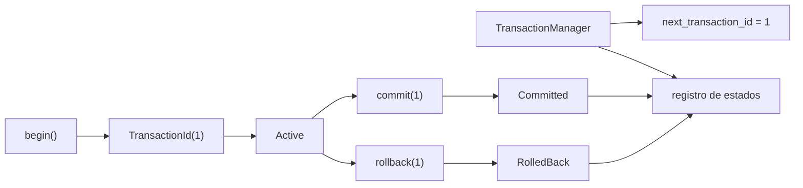

# Transacciones

> **Estado:** borrador técnico de ciclo de vida.
> **Alcance actual:** `TransactionId`, `TransactionState`,
> `TransactionManager`, registro explícito de estado inicial, `begin`, `commit`,
> `rollback` y validación de transiciones.

## Por Qué Existe

Una transacción existe porque una base de datos no solo guarda valores: debe
proteger unidades de trabajo. Un pago, una reserva o una transferencia no son
una lista de escrituras sueltas; son una intención que debe terminar de forma
coherente.

Antes de hablar de atomicidad, aislamiento o recovery, el curso necesita fijar
el vocabulario mínimo:

- qué identifica una transacción;
- en qué estado está;
- quién registra ese estado.

Este capítulo empieza ahí. Las operaciones `begin`, `commit` y `rollback`
modelan el ciclo mínimo. Los conflictos simples se dejan para el siguiente
paso.

## Modelo Actual Del Curso

El modelo Rust actual define tres piezas:

- `TransactionId`: identificador lógico de una transacción;
- `TransactionState`: estado visible (`Active`, `Committed`, `RolledBack`);
- `TransactionManager`: registro educativo de transacciones conocidas.

`TransactionManager::new` crea un administrador vacío. El primer
`TransactionId` disponible es `1`. Registrar una transacción avanza el siguiente
identificador y permite consultar el estado asociado.

`TransactionManager::begin` abre una transacción en estado `Active`.
`TransactionManager::commit` cierra una transacción activa en estado
`Committed`. `TransactionManager::rollback` cierra una transacción activa en
estado `RolledBack`.

## Estados

Los estados actuales nombran el ciclo de vida mínimo:

| Estado | Significado |
|--------|-------------|
| `Active` | La transacción está abierta y puede recibir trabajo. |
| `Committed` | La transacción terminó aceptando sus cambios. |
| `RolledBack` | La transacción terminó descartando sus cambios. |

`Committed` y `RolledBack` son estados terminales. Una vez que una transacción
termina, no puede volver a cerrarse ni regresar a `Active`.

## Transiciones

| Operación | Estado inicial permitido | Estado final |
|-----------|--------------------------|--------------|
| `begin` | no aplica | `Active` |
| `commit` | `Active` | `Committed` |
| `rollback` | `Active` | `RolledBack` |

Si la transacción no existe, `commit` y `rollback` devuelven
`TransactionError::UnknownTransaction`. Si la transacción existe, pero ya está
cerrada, devuelven `TransactionError::InvalidStateTransition`.

## Diagrama Mental

## Invariantes Del Modelo

- `TransactionId` expone un valor lógico estable.
- `TransactionManager` inicia vacío.
- El primer identificador disponible es `TransactionId(1)`.
- Registrar una transacción devuelve el identificador asignado.
- Registrar una transacción incrementa el siguiente identificador.
- `begin` registra una transacción activa.
- `commit` solo acepta transacciones activas.
- `rollback` solo acepta transacciones activas.
- `Committed` y `RolledBack` son estados terminales.
- Consultar una transacción inexistente devuelve `None`.
- Intentar cerrar una transacción inexistente devuelve
  `TransactionError::UnknownTransaction`.
- Intentar cerrar una transacción terminal devuelve
  `TransactionError::InvalidStateTransition`.
- `TransactionState::as_str` devuelve un nombre estable para documentación y
  ejemplos.

## Lo Que Todavía No Modela

Este modelo todavía no implementa:

- conflictos entre transacciones;
- locks;
- aislamiento;
- WAL, recovery o durabilidad.

La frontera es deliberada. Primero se nombra el sistema; después se agregan
transiciones y reglas.
