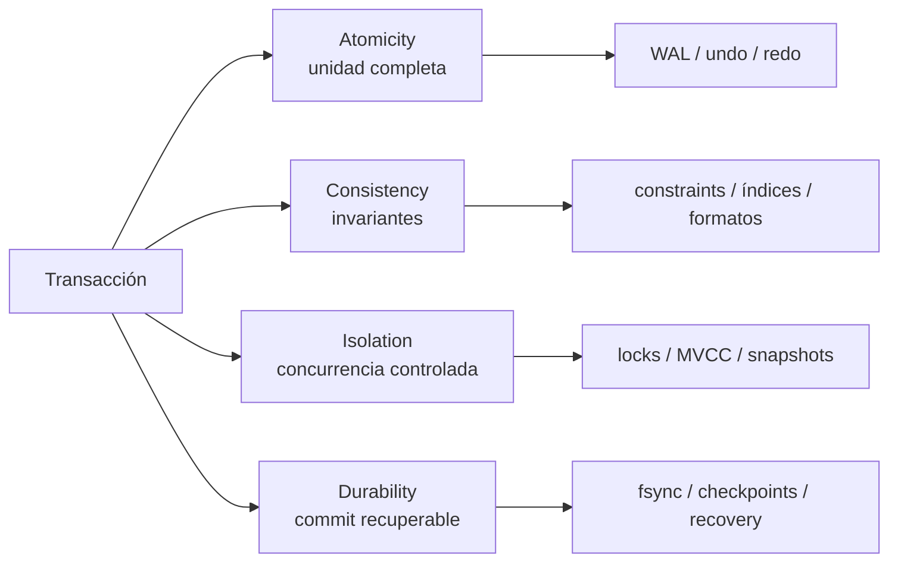

# ACID

> **Estado:** borrador técnico de propiedades.
> **Alcance actual:** Atomicity, Consistency, Isolation y Durability desde el
> punto de vista de internals; modelos Rust mínimos para cada propiedad. Los
> ejercicios de fallas parciales y benchmarks se agregan en pasos posteriores.

## Por Qué Existe

ACID existe porque una base de datos no solo debe responder rápido; debe
preservar confianza cuando algo sale mal. Un motor puede tener índices
brillantes, páginas bien organizadas y consultas optimizadas, pero si pierde la
frontera entre "esto ocurrió" y "esto no ocurrió", deja de ser una base de
datos confiable.

Las cuatro propiedades no son adornos académicos. Son nombres para presiones
internas muy concretas:

- una unidad de trabajo debe terminar completa o descartarse;
- las reglas del sistema no deben romperse;
- transacciones concurrentes no deben pisarse de forma incoherente;
- lo confirmado debe sobrevivir fallas relevantes.

Este capítulo documenta esas propiedades como mapa mental del curso. Los
capítulos siguientes bajan cada idea a mecanismos: transacciones, MVCC, WAL,
recovery y replicación.

## Modelo Mental

```text
begin
  -> cambios tentativos
  -> verificar reglas
  -> aislar trabajo concurrente
  -> commit durable
```

ACID no dice que exista un solo algoritmo correcto. Dice qué promesas debe
defender el motor. Dos motores pueden cumplir ACID con mecanismos distintos:
locks, MVCC, snapshots, logs append-only, checkpoints, fsync, replicación o
combinaciones de esas piezas.

## Modelo Rust Actual

El módulo `src/acid.rs` contiene cuatro modelos mínimos:

- `AtomicUnit`: unidad de cambios tentativos que se confirma o se revierte
  completa;
- `UniqueConstraint`: constraint de unicidad para enseñar consistencia;
- `ReadCommittedCell`: celda con valor confirmado y escritura pendiente para
  enseñar aislamiento de lectura confirmada;
- `CommitLog`: log educativo donde un commit solo es durable después de
  sincronizarse.

Estos modelos no reemplazan transacciones, MVCC ni WAL. Son laboratorios
pequeños para sentir qué promete cada letra antes de construir mecanismos más
realistas.

## Atomicity

Atomicity significa que una transacción se acepta como unidad o se descarta
como unidad. El usuario no debería ver "medio pago", "media reserva" o "medio
movimiento contable".

Desde internals, atomicidad obliga al motor a distinguir tres cosas:

- trabajo tentativo;
- decisión de cierre (`commit` o `rollback`);
- acciones necesarias para deshacer o rehacer cambios.

En el capítulo de Transacciones, esta propiedad aparece como ciclo de vida:
`Active`, `Committed` y `RolledBack`. Ese modelo todavía no guarda páginas ni
mantiene undo/redo, pero ya enseña una idea clave: una transacción cerrada no
vuelve a estar abierta.

En `AtomicUnit`, los cambios entran primero a `staged_changes`. `commit` mueve
todos esos cambios a `committed_changes`. `rollback` los descarta. Si la unidad
ya está cerrada, cualquier intento de agregar más cambios devuelve
`AcidError::ClosedAtomicUnit`.

En un motor real, atomicidad suele apoyarse en:

- undo logs para revertir cambios no confirmados;
- redo logs para reconstruir cambios confirmados;
- un punto inequívoco donde `commit` se vuelve visible;
- reglas que impiden publicar resultados parciales.

## Consistency

Consistency significa que una transacción lleva la base de datos de un estado
válido a otro estado válido. No promete que la regla de negocio sea correcta;
promete que el motor tiene lugares donde defender invariantes.

Desde internals, consistencia puede aparecer en varias capas:

- tipos y formatos de registro válidos;
- constraints como unicidad o claves requeridas;
- relaciones entre índices y filas;
- invariantes de estructuras físicas como B-Tree o LSM Tree;
- reglas transaccionales como "una transacción cerrada no cambia otra vez".

Un ejemplo pequeño:

```text
customers.email debe ser único

insert ana@example.com -> ok
insert ana@example.com -> rechazar antes de commit
```

La consistencia no reemplaza validación de dominio. Un banco todavía debe saber
qué significa una transferencia legítima. El motor provee mecanismos para que
esas reglas se representen y no queden a merced de escrituras sueltas.

En `UniqueConstraint`, insertar un valor nuevo preserva la invariante. Insertar
el mismo valor dos veces devuelve `AcidError::ConsistencyViolation` con el
nombre de la invariante y el valor rechazado.

## Isolation

Isolation significa que las transacciones concurrentes no deben observarse de
una forma que rompa la historia que el motor prometió.

El aislamiento no es una sola cosa. Es un espectro de promesas:

| Nivel conceptual | Pregunta que responde |
|------------------|-----------------------|
| Evitar escritura simultánea | ¿Dos transacciones pueden modificar el mismo recurso a la vez? |
| Evitar lecturas sucias | ¿Una transacción puede leer cambios no confirmados de otra? |
| Lecturas repetibles | ¿La misma lectura conserva su respuesta dentro de la transacción? |
| Serialización | ¿El resultado equivale a ejecutar transacciones una por una? |

En este curso, el primer modelo de aislamiento es deliberadamente pequeño:
`TransactionManager::lock_exclusive` permite que una transacción activa proteja
un `ResourceId`. Si otra transacción intenta tomarlo, recibe
`TransactionError::ResourceConflict`.

MVCC ampliará esta idea desde otra dirección: en vez de bloquear todo, el motor
puede mantener versiones y snapshots para decidir qué ve cada transacción.

En `ReadCommittedCell`, una escritura pendiente no cambia lo que devuelve
`read_committed`. Solo `commit_pending` publica el valor. Si otro escritor
intenta preparar un cambio mientras hay uno pendiente, el modelo devuelve
`AcidError::PendingWriteConflict`.

## Durability

Durability significa que, una vez confirmado el `commit`, el sistema puede
recuperar ese resultado después de una falla dentro del contrato prometido.

Desde internals, durabilidad no es "guardar en disco" como frase vaga. Es una
cadena de decisiones:

- qué se escribe antes de responder `commit`;
- dónde se escribe;
- cuándo se fuerza al sistema operativo o al dispositivo;
- cómo se detecta un registro parcial;
- cómo se reconstruye el estado al arrancar después de un crash.

La durabilidad suele apoyarse en Write-Ahead Log:

```text
1. escribir intención en WAL
2. asegurar WAL según la política del motor
3. aplicar o dejar pendiente el cambio en páginas de datos
4. responder commit
5. usar recovery para rehacer lo confirmado tras una falla
```

Este capítulo no implementa WAL ni recovery. Solo deja la promesa bien nombrada
para que el capítulo de Write-Ahead Log pueda explicar la regla central:
primero el log, después la página.

En `CommitLog`, `append_commit` registra un commit todavía no durable.
`sync` marca ese commit como durable. Consultar `is_durable` antes y después de
`sync` separa la idea de "registrado en memoria del modelo" de "prometido como
recuperable".

## Cómo Se Relacionan

ACID se entiende mejor como un conjunto de tensiones, no como una lista
aislada.



Una falla de atomicidad produce cambios a medias. Una falla de consistencia
permite estados inválidos. Una falla de aislamiento permite historias
concurrentes incoherentes. Una falla de durabilidad pierde trabajo que el motor
ya había prometido conservar.

## Invariantes Del Capítulo

- Atomicity protege la unidad de cierre de una transacción.
- Consistency protege invariantes del modelo lógico y físico.
- Isolation protege la convivencia entre transacciones concurrentes.
- Durability protege la supervivencia de un `commit` frente a fallas.
- ACID describe promesas del motor, no un único algoritmo de implementación.
- El modelo actual de Transacciones solo cubre una parte pequeña de Atomicity e
  Isolation.
- `AtomicUnit` confirma o descarta todos sus cambios tentativos como unidad.
- `UniqueConstraint` rechaza valores duplicados para preservar una invariante.
- `ReadCommittedCell` oculta escrituras pendientes hasta que se confirman.
- `CommitLog` no considera durable un commit hasta que se sincroniza.
- Consistency se conecta con índices, constraints e invariantes de estructuras.
- Durability se conecta con WAL, recovery y checkpoints.

## Lo Que Todavía No Modela

Este capítulo todavía no implementa:

- fallas parciales ejecutables;
- WAL, redo, undo o recovery;
- niveles formales de aislamiento;
- integración con MVCC.

La frontera es intencional. Ya existen modelos mínimos para sentir cada
promesa; el siguiente paso agrega fallas parciales ejecutables para observar
dónde se rompe cada una.
