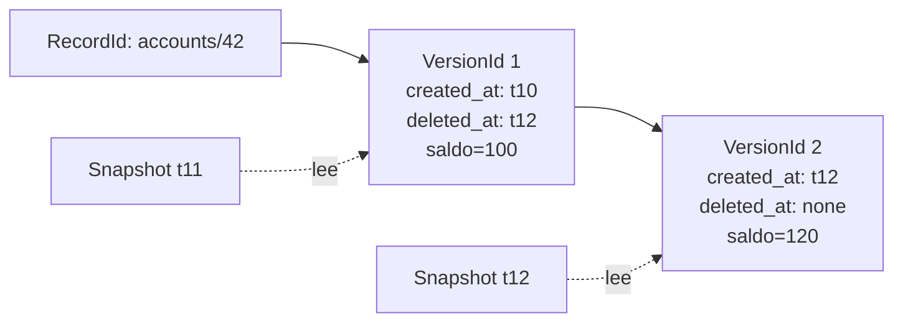

# MVCC

> **Estado:** benchmarked.
> **Alcance actual:** representación de versiones de registro, timestamps
> lógicos, metadatos de visibilidad, snapshot reads básicos y decisiones
> explícitas de visibilidad por timestamp. Incluye ejemplos progresivos,
> ejercicios, soluciones, diagrama Mermaid, benchmark manual y comparación
> educativa con PostgreSQL sin convertirlo en dependencia del curso.

## Por qué existe

MVCC significa *Multi-Version Concurrency Control*. La idea central es sencilla:
un registro lógico no tiene que ser una sola celda mutable. Puede tener varias
versiones, y cada transacción observa la versión que corresponde a su momento
de lectura.

Sin MVCC, una actualización concurrente suele empujar al motor hacia bloqueos:
si alguien escribe `accounts/42`, otros lectores pueden tener que esperar para
no ver un estado intermedio. Con MVCC, el motor conserva versiones anteriores y
puede permitir que lectores sigan avanzando mientras una escritura produce una
versión nueva.

El primer paso fue representar la historia. El segundo paso agrega una pregunta
concreta: si una lectura ocurre en un timestamp lógico, ¿qué versión debe ver?
Para responder sin mezclar todavía transacciones reales, el curso usa un
`Snapshot` pequeño.

Antes de decidir qué versión ve una transacción, el curso necesita una
representación explícita de lo que existe:

- cuál es el registro lógico;
- cuál es la versión concreta;
- cuándo nació la versión;
- si la versión ya fue cerrada por un borrado lógico;
- qué valor guarda esa versión.

## Modelo mental

```text
registro lógico: accounts/42

v1 nace en t10 con saldo=100
v1 se cierra en t12
v2 nace en t12 con saldo=120

snapshot t11 lee v1
snapshot t12 lee v2

visibilidad de v1:
t09 -> NotYetCreated
t10 -> Visible
t11 -> Visible
t12 -> Deleted
```

Una versión no se borra físicamente en este modelo inicial. Queda marcada con
un timestamp de cierre. Esa diferencia importa porque un lector antiguo podría
seguir necesitando la versión anterior, mientras un lector nuevo debería ver la
versión más reciente.

## Modelo Rust actual

El módulo `src/mvcc.rs` expone estos tipos:

| Tipo | Responsabilidad |
|------|-----------------|
| `RecordId` | Identifica el registro lógico, por ejemplo `accounts/42`. |
| `RecordValue` | Guarda el valor educativo asociado a una versión. |
| `VersionId` | Identifica una versión dentro de una cadena. |
| `LogicalTimestamp` | Ordena creación y cierre de versiones. |
| `Snapshot` | Representa el timestamp lógico de una lectura. |
| `VisibilityDecision` | Explica por qué una versión es visible o no en un timestamp. |
| `RecordVersion` | Representa una versión concreta con metadatos de visibilidad. |
| `VersionChain` | Agrupa versiones de un mismo registro lógico en orden de creación. |
| `MvccError` | Nombra violaciones de invariantes del modelo. |

El diseño mantiene el valor como texto para no mezclar MVCC con serialización,
tipos SQL o formatos físicos de página. Es una decisión deliberada: este
capítulo está enseñando visibilidad, no almacenamiento de filas.

## Invariantes

El modelo actual defiende estas reglas:

- `RecordId` no acepta texto vacío después de recortar espacios.
- `RecordValue` no acepta texto vacío después de recortar espacios.
- una `RecordVersion` nace con `created_at` y sin `deleted_at`;
- `delete_at` no puede usar un timestamp anterior al de creación;
- una versión solo puede cerrarse una vez;
- una `VersionChain` solo acepta timestamps de creación monótonos;
- los `VersionId` asignados por `VersionChain::append` son secuenciales desde
  `1`.
- una versión es visible si `created_at <= snapshot.read_at`;
- una versión deja de ser visible cuando `snapshot.read_at >= deleted_at`;
- `VersionChain::read` devuelve la versión visible más reciente para el
  snapshot.
- `RecordVersion::visibility_at` distingue `Visible`, `NotYetCreated` y
  `Deleted`.

Estas invariantes son pequeñas, pero fijan la frontera mental del capítulo. Una
cadena de versiones desordenada vuelve ambiguas las lecturas por snapshot; una
versión que se borra dos veces vuelve confusa la historia; un registro sin
identidad estable no puede indexarse ni compararse.

## Diagrama



El diagrama muestra una actualización como cierre de una versión y creación de
otra. En un motor real, el cierre puede representarse con metadatos de
transacción, timestamps, referencias a undo o reglas específicas del motor. En
este curso lo reducimos a timestamps lógicos para que la idea sea visible.

Diagrama fuente: `diagrams/06-mvcc.mmd`.

## Ejemplo básico

```rust
use rust_database_internals::mvcc::{
    LogicalTimestamp, RecordId, RecordValue, Snapshot, VersionChain,
};

let record_id = RecordId::new("accounts/42")?;
let mut chain = VersionChain::new(record_id);

let first = chain.append(
    LogicalTimestamp::new(10),
    RecordValue::new("saldo=100")?,
)?;
chain.delete_latest_at(LogicalTimestamp::new(12))?;
let second = chain.append(
    LogicalTimestamp::new(12),
    RecordValue::new("saldo=120")?,
)?;

assert_eq!(first.value(), 1);
assert_eq!(second.value(), 2);
assert_eq!(
    chain
        .read(&Snapshot::new(LogicalTimestamp::new(12)))
        .unwrap()
        .value()
        .as_str(),
    "saldo=120"
);
# Ok::<(), rust_database_internals::mvcc::MvccError>(())
```

El ejemplo consulta la versión visible para un snapshot, no solo la versión más
reciente de la cadena.

## Ejemplos progresivos

Los ejemplos del capítulo viven en `examples/` y se pueden ejecutar con
`cargo run --example <nombre>`.

| Ejemplo | Propósito |
|---------|-----------|
| `mvcc_basic` | Leer una primera versión con un snapshot simple. |
| `mvcc_intermediate` | Comparar un snapshot antiguo contra uno nuevo después de una actualización. |
| `mvcc_advanced` | Observar que un borrado lógico oculta una versión para snapshots nuevos. |
| `mvcc_visibility` | Revisar los bordes `NotYetCreated`, `Visible` y `Deleted`. |

## Regla de snapshot read

La regla actual es deliberadamente explícita:

```text
visible(version, snapshot) =
    version.created_at <= snapshot.read_at
    y
    (version.deleted_at no existe o snapshot.read_at < version.deleted_at)
```

`VersionChain::read` recorre las versiones desde la más reciente hacia atrás y
devuelve la primera que cumple esa regla. Esto permite que un snapshot antiguo
siga viendo una versión cerrada después, mientras un snapshot nuevo ve la
versión actual o `None` si el registro fue borrado sin reemplazo.

## Decisiones de visibilidad

`RecordVersion::visibility_at` devuelve `VisibilityDecision`, no solo un
booleano. Eso hace visible la razón de cada resultado:

| Decisión | Significado |
|----------|-------------|
| `NotYetCreated` | La lectura ocurrió antes de `created_at`. |
| `Visible` | La lectura cayó dentro de la ventana visible de la versión. |
| `Deleted` | La lectura ocurrió en `deleted_at` o después. |

Con `created_at = t10` y `deleted_at = t12`, la ventana visible es `[t10,
t12)`: incluye el inicio, excluye el cierre. Esta frontera permite que una
actualización cierre una versión vieja y cree una nueva en el mismo timestamp
lógico sin que ambas sean visibles para el mismo snapshot.

## Ejercicios

Los ejercicios están pensados para reforzar la regla de visibilidad antes de
mezclar MVCC con transacciones reales, índices o WAL.

### Nivel 1: Snapshot read básico

Construye una `VersionChain` para `accounts/42`, agrega una versión en `t10` y
lee con un `Snapshot` en `t10`.

La solución debe demostrar:

- que el snapshot encuentra una versión;
- que el valor visible es `saldo=100`;
- que el `VersionId` asignado es `1`.

Solución ejecutable:

```bash
cargo run --example mvcc_snapshot_read
```

### Nivel 2: Ventana de visibilidad

Crea una `RecordVersion` que nace en `t10`, ciérrala en `t12` y evalúa cuatro
lecturas: `t9`, `t10`, `t11` y `t12`.

La solución debe distinguir:

- `NotYetCreated` antes de `t10`;
- `Visible` en `t10` y `t11`;
- `Deleted` desde `t12`.

Solución ejecutable:

```bash
cargo run --example mvcc_visibility_window
```

### Nivel 3: Borrado lógico

Agrega una versión en `t10`, ciérrala en `t12` y compara dos snapshots: uno en
`t11` y otro en `t12`.

La solución debe mostrar que:

- un snapshot anterior al cierre todavía observa la versión;
- un snapshot nuevo ya no ve el registro;
- el borrado lógico no destruye inmediatamente la historia.

Solución ejecutable:

```bash
cargo run --example mvcc_logical_delete
```

## Benchmark manual

El benchmark del capítulo mide operaciones pequeñas y deliberadas:

- append de versiones en una cadena;
- snapshot reads sobre una cadena con historia;
- decisiones explícitas de visibilidad;
- borrado lógico de la versión más reciente.

Ejecutar:

```bash
cargo bench --bench mvcc_bench
```

El objetivo no es competir contra PostgreSQL ni contra un motor real. La
medición ayuda a conectar la regla conceptual con costos observables: leer un
snapshot requiere buscar la versión visible; conservar historia tiene costo;
cerrar una versión es distinto de borrarla físicamente.

## Comparación con PostgreSQL

PostgreSQL es una referencia útil porque implementa MVCC en un motor real y
maduro. Su documentación oficial describe que cada sentencia observa una
versión de la base de datos como existía en algún momento anterior, y que las
lecturas no bloquean escrituras ni las escrituras bloquean lecturas bajo el
modelo MVCC. Este curso conserva esa intuición, pero reduce el mecanismo para
que pueda estudiarse en pocas estructuras Rust.

La comparación debe leerse así:

| Curso | PostgreSQL | Diferencia importante |
|-------|------------|-----------------------|
| `RecordId` | fila lógica identificada por clave de dominio | PostgreSQL no depende de una cadena como `accounts/42`; el identificador lógico suele venir de una clave primaria o de la consulta. |
| `RecordVersion` | versión de fila o tupla | PostgreSQL crea nuevas versiones de fila al actualizar; este curso guarda la historia en una `VersionChain` explícita. |
| `created_at` | idea cercana a `xmin` | En PostgreSQL `xmin` es el XID que insertó la versión, no un timestamp lógico simple. |
| `deleted_at` | idea cercana a `xmax` | En PostgreSQL `xmax` puede ser distinto de cero aunque la versión aún sea visible, por ejemplo si la transacción que borró no ha confirmado o abortó. |
| `Snapshot` | snapshot de sentencia o transacción | En PostgreSQL `Read Committed` toma snapshot por sentencia; `Repeatable Read` conserva una vista estable desde el inicio efectivo de la transacción. |
| `VisibilityDecision` | regla interna de visibilidad | PostgreSQL consulta XIDs, estado de transacciones, snapshots y más metadatos; aquí solo hay `Visible`, `NotYetCreated` y `Deleted`. |
| `VersionChain::read` | elegir la versión visible de una fila | PostgreSQL debe hacerlo dentro de páginas, índices, heap tuples, locks y reglas de aislamiento reales. |

### `xmin`, `xmax` y `ctid`

PostgreSQL expone columnas de sistema que ayudan a entender MVCC:

- `xmin` identifica la transacción que insertó una versión de fila;
- `xmax` identifica la transacción que borró una versión, o queda en cero si no
  fue borrada;
- `ctid` apunta a la ubicación física de una versión de fila.

Nuestro modelo traduce esa idea a nombres más pedagógicos: `created_at`,
`deleted_at` y `VersionId`. Esta traducción es útil para aprender, pero no debe
confundirse con el diseño real de PostgreSQL. En especial, `ctid` no debe
usarse como identidad lógica estable porque puede cambiar cuando una fila se
actualiza o se mueve por mantenimiento.

### Snapshots e aislamiento

PostgreSQL diferencia niveles de aislamiento. En `Read Committed`, que es el
nivel por defecto, cada sentencia ve datos confirmados antes de que la consulta
comience. Por eso dos consultas dentro de una misma transacción pueden ver
resultados distintos si otra transacción confirma entre ambas.

En `Repeatable Read`, una transacción conserva una vista estable desde el inicio
de su primera sentencia relevante. Eso se parece más a crear un `Snapshot` una
vez y reusarlo. Este curso empieza con un `Snapshot` explícito porque permite
separar dos preguntas:

- qué versiones existen;
- qué versión puede observar una lectura.

### Vacuum y versiones muertas

MVCC crea versiones antiguas. En PostgreSQL, un `UPDATE` o `DELETE` no elimina
inmediatamente la versión anterior de la fila porque todavía podría ser visible
para transacciones que conservan snapshots antiguos. Cuando ya no puede ser
vista por ninguna transacción relevante, `VACUUM` puede recuperar espacio y
mantener saludable el sistema.

Este capítulo no implementa vacuum. La ausencia es intencional: primero se
aprende a conservar historia y leerla correctamente; después, en capítulos de
WAL, recovery y mantenimiento, se puede estudiar cómo un motor limpia, compacta
y recupera estructuras sin romper garantías.

### Dónde termina la comparación

El modelo del curso no implementa:

- transacciones activas, confirmadas o abortadas;
- snapshots con conjuntos de XIDs activos;
- `cmin`, `cmax`, command IDs ni efectos de la misma transacción;
- `ctid`, páginas heap, HOT updates ni visibilidad de índices;
- Serializable Snapshot Isolation;
- autovacuum, freezing ni protección contra wraparound de XIDs.

PostgreSQL entra aquí como mapa de orientación. El objetivo no es copiar su
código ni simplificarlo de más; el objetivo es que, cuando el estudiante lea
`xmin`, `xmax`, snapshots o vacuum en documentación real, ya tenga una imagen
mental pequeña y probada en Rust.

## Lo que aún no hace

Este modelo todavía no decide:

- qué snapshot obtiene una transacción real al comenzar;
- cómo se modelan transacciones activas, confirmadas o abortadas dentro de la
  regla de visibilidad;
- qué ocurre con versiones de transacciones abortadas;
- cuándo una versión antigua puede ser recolectada;
- cómo se integran índices, heap pages y limpieza de versiones muertas.

Esa separación evita un error común: querer explicar MVCC completo antes de
tener una representación mínima verificable. Primero se representa la historia;
después se decide qué lector puede observar cada parte de esa historia.

## Fuentes oficiales consultadas

- PostgreSQL 18: `13.1 Introduction`, documentación oficial de MVCC:
  <https://www.postgresql.org/docs/current/mvcc-intro.html>
- PostgreSQL 18: `5.6 System Columns`, columnas `xmin`, `xmax` y `ctid`:
  <https://www.postgresql.org/docs/current/ddl-system-columns.html>
- PostgreSQL 18: `13.2 Transaction Isolation`, snapshots por nivel de
  aislamiento:
  <https://www.postgresql.org/docs/current/transaction-iso.html>
- PostgreSQL 18: `24.1 Routine Vacuuming`, recuperación de espacio y versiones
  muertas:
  <https://www.postgresql.org/docs/current/routine-vacuuming.html>

## Siguiente paso natural

El siguiente paso natural del curso es una revisión humana completa del bloque
`benchmarked`: validar tono, precisión pedagógica, ejercicios, soluciones,
benchmarks y diagramas antes de decidir si algún capítulo puede pasar a
`reviewed`.
