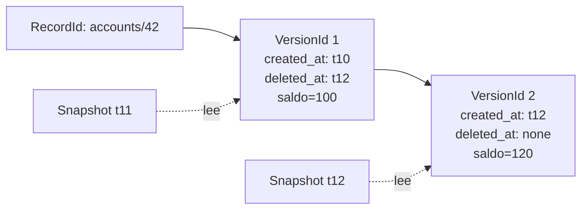

# MVCC

> **Estado:** draft.
> **Alcance actual:** representación de versiones de registro, timestamps
> lógicos, metadatos de visibilidad y snapshot reads básicos. Reglas completas
> de visibilidad y comparación con PostgreSQL quedan para los siguientes pasos
> del capítulo.

## Por qué existe

MVCC significa *Multi-Version Concurrency Control*. La idea central es sencilla:
un registro lógico no tiene que ser una sola celda mutable. Puede tener varias
versiones, y cada transacción observa la versión que corresponde a su momento
de lectura.

Sin MVCC, una actualización concurrente suele empujar al motor hacia bloqueos:
si alguien escribe `accounts/42`, otros lectores pueden tener que esperar para
no ver un estado intermedio. Con MVCC, el motor conserva versiones anteriores y
puede permitir que lectores sigan avanzando mientras una escritura produce una
versión nueva.

El primer paso fue representar la historia. El segundo paso agrega una pregunta
concreta: si una lectura ocurre en un timestamp lógico, ¿qué versión debe ver?
Para responder sin mezclar todavía transacciones reales, el curso usa un
`Snapshot` pequeño.

Antes de decidir qué versión ve una transacción, el curso necesita una
representación explícita de lo que existe:

- cuál es el registro lógico;
- cuál es la versión concreta;
- cuándo nació la versión;
- si la versión ya fue cerrada por un borrado lógico;
- qué valor guarda esa versión.

## Modelo mental

```text
registro lógico: accounts/42

v1 nace en t10 con saldo=100
v1 se cierra en t12
v2 nace en t12 con saldo=120

snapshot t11 lee v1
snapshot t12 lee v2
```

Una versión no se borra físicamente en este modelo inicial. Queda marcada con
un timestamp de cierre. Esa diferencia importa porque un lector antiguo podría
seguir necesitando la versión anterior, mientras un lector nuevo debería ver la
versión más reciente.

## Modelo Rust actual

El módulo `src/mvcc.rs` expone estos tipos:

| Tipo | Responsabilidad |
|------|-----------------|
| `RecordId` | Identifica el registro lógico, por ejemplo `accounts/42`. |
| `RecordValue` | Guarda el valor educativo asociado a una versión. |
| `VersionId` | Identifica una versión dentro de una cadena. |
| `LogicalTimestamp` | Ordena creación y cierre de versiones. |
| `Snapshot` | Representa el timestamp lógico de una lectura. |
| `RecordVersion` | Representa una versión concreta con metadatos de visibilidad. |
| `VersionChain` | Agrupa versiones de un mismo registro lógico en orden de creación. |
| `MvccError` | Nombra violaciones de invariantes del modelo. |

El diseño mantiene el valor como texto para no mezclar MVCC con serialización,
tipos SQL o formatos físicos de página. Es una decisión deliberada: este
capítulo está enseñando visibilidad, no almacenamiento de filas.

## Invariantes

El modelo actual defiende estas reglas:

- `RecordId` no acepta texto vacío después de recortar espacios.
- `RecordValue` no acepta texto vacío después de recortar espacios.
- una `RecordVersion` nace con `created_at` y sin `deleted_at`;
- `delete_at` no puede usar un timestamp anterior al de creación;
- una versión solo puede cerrarse una vez;
- una `VersionChain` solo acepta timestamps de creación monótonos;
- los `VersionId` asignados por `VersionChain::append` son secuenciales desde
  `1`.
- una versión es visible si `created_at <= snapshot.read_at`;
- una versión deja de ser visible cuando `snapshot.read_at >= deleted_at`;
- `VersionChain::read` devuelve la versión visible más reciente para el
  snapshot.

Estas invariantes son pequeñas, pero fijan la frontera mental del capítulo. Una
cadena de versiones desordenada vuelve ambiguas las lecturas por snapshot; una
versión que se borra dos veces vuelve confusa la historia; un registro sin
identidad estable no puede indexarse ni compararse.

## Diagrama



El diagrama muestra una actualización como cierre de una versión y creación de
otra. En un motor real, el cierre puede representarse con metadatos de
transacción, timestamps, referencias a undo o reglas específicas del motor. En
este curso lo reducimos a timestamps lógicos para que la idea sea visible.

## Ejemplo básico

```rust
use rust_database_internals::mvcc::{
    LogicalTimestamp, RecordId, RecordValue, Snapshot, VersionChain,
};

let record_id = RecordId::new("accounts/42")?;
let mut chain = VersionChain::new(record_id);

let first = chain.append(
    LogicalTimestamp::new(10),
    RecordValue::new("saldo=100")?,
)?;
let second = chain.append(
    LogicalTimestamp::new(12),
    RecordValue::new("saldo=120")?,
)?;

assert_eq!(first.value(), 1);
assert_eq!(second.value(), 2);
assert_eq!(
    chain
        .read(&Snapshot::new(LogicalTimestamp::new(12)))
        .unwrap()
        .value()
        .as_str(),
    "saldo=120"
);
# Ok::<(), rust_database_internals::mvcc::MvccError>(())
```

El ejemplo consulta la versión visible para un snapshot, no solo la versión más
reciente de la cadena.

## Ejemplos progresivos

Los ejemplos del capítulo viven en `examples/` y se pueden ejecutar con
`cargo run --example <nombre>`.

| Ejemplo | Propósito |
|---------|-----------|
| `mvcc_basic` | Leer una primera versión con un snapshot simple. |
| `mvcc_intermediate` | Comparar un snapshot antiguo contra uno nuevo después de una actualización. |
| `mvcc_advanced` | Observar que un borrado lógico oculta una versión para snapshots nuevos. |

## Regla de snapshot read

La regla actual es deliberadamente pequeña:

```text
visible(version, snapshot) =
    version.created_at <= snapshot.read_at
    y
    (version.deleted_at no existe o snapshot.read_at < version.deleted_at)
```

`VersionChain::read` recorre las versiones desde la más reciente hacia atrás y
devuelve la primera que cumple esa regla. Esto permite que un snapshot antiguo
siga viendo una versión cerrada después, mientras un snapshot nuevo ve la
versión actual o `None` si el registro fue borrado sin reemplazo.

## Lo que aún no hace

Este borrador no decide todavía:

- qué snapshot obtiene una transacción real al comenzar;
- cómo se modelan transacciones activas, confirmadas o abortadas dentro de la
  regla de visibilidad;
- qué ocurre con versiones de transacciones abortadas;
- cuándo una versión antigua puede ser recolectada;
- cómo se compara este modelo con `xmin`, `xmax` y snapshots de PostgreSQL.

Esa separación evita un error común: querer explicar MVCC completo antes de
tener una representación mínima verificable. Primero se representa la historia;
después se decide qué lector puede observar cada parte de esa historia.

## Siguiente paso natural

El siguiente paso del capítulo es modelar visibilidad por timestamp lógico con
un vocabulario más cercano a transacciones. Después se documentará la relación
con PostgreSQL como comparación, sin volver el curso dependiente de PostgreSQL.
