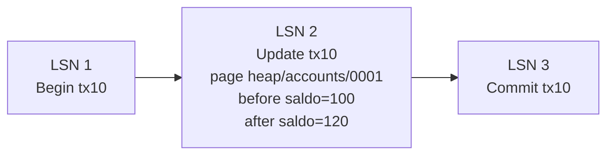

# Write-Ahead Log

> **Estado:** tested.
> **Alcance actual:** representación de registros WAL, LSN, transacción lógica,
> página lógica, imagen antes/después, tipos de operación educativos y log
> append-only en memoria. Incluye redo y undo educativos sobre un almacén de
> páginas en memoria. Documenta la regla central: escribir el log antes de
> modificar la página.

## Por qué existe

Write-Ahead Log existe porque una base de datos no puede confiar solo en el
estado final de sus páginas. Si el proceso cae a mitad de una escritura, el
motor necesita una historia ordenada para responder dos preguntas:

- qué cambios confirmados deben rehacerse;
- qué cambios incompletos deben deshacerse.

La idea central es escribir primero una descripción durable del cambio y
después modificar la página de datos. Por eso se llama *write-ahead*: el log va
delante de la página.

El primer paso fija el vocabulario mínimo para que los siguientes pasos no
mezclen conceptos. El segundo paso agrega un log append-only en memoria:
registros que entran al final, reciben LSN monótono y preservan orden.
El tercer paso aplica esos registros sobre un almacén educativo de páginas:
redo escribe `after`; undo restaura `before`.
El cuarto paso nombra la regla que mantiene coherente todo el modelo: antes de
modificar una página, el registro que describe ese cambio debe existir en el
WAL.

## Modelo mental

```text
LSN 1: begin tx10
LSN 2: update tx10 page heap/accounts/0001 before saldo=100 after saldo=120
LSN 3: commit tx10
```

El WAL no guarda "un comentario". Guarda una secuencia ordenada de registros
con suficiente información para reconstruir decisiones después de una falla.

## Modelo Rust actual

El módulo `src/wal.rs` expone estos tipos:

| Tipo | Responsabilidad |
|------|-----------------|
| `LogSequenceNumber` | Posición lógica de un registro WAL. |
| `WalTransactionId` | Transacción lógica asociada a un registro. |
| `PageId` | Página lógica afectada por una actualización. |
| `PageImage` | Imagen educativa antes o después del cambio. |
| `LogOperation` | Operación registrada: `Begin`, `Update`, `Commit`, `Rollback`. |
| `LogRecord` | Registro WAL con LSN, transacción y operación. |
| `WriteAheadLog` | Secuencia append-only de registros en orden de LSN. |
| `PageStore` | Almacén educativo de páginas para aplicar redo y undo. |
| `WalError` | Errores de representación del modelo WAL. |

El modelo usa texto para representar imágenes de página. Es deliberado: el
capítulo no intenta enseñar todavía layout físico, checksums, buffers ni I/O.
Primero se necesita una unidad clara de historia.

## Invariantes

El modelo actual defiende estas reglas:

- `PageId` no acepta texto vacío después de recortar espacios;
- `PageImage` no acepta texto vacío después de recortar espacios;
- una operación `Update` requiere una imagen `before` y una imagen `after`
  distintas;
- un registro WAL siempre tiene LSN, transacción y operación;
- solo `Update` es redoable y undoable en este modelo inicial;
- `Begin`, `Commit` y `Rollback` nombran transiciones, pero no contienen delta
  de página;
- `WriteAheadLog` asigna LSN desde `1` de forma monótona;
- `WriteAheadLog::append_record` rechaza registros cuyo LSN no coincide con el
  siguiente esperado;
- los registros se recorren en el mismo orden en el que se agregaron;
- `PageStore::redo` solo acepta registros `Update` y escribe la imagen `after`;
- `PageStore::undo` solo acepta registros `Update` y escribe la imagen
  `before`;
- `Begin`, `Commit` y `Rollback` no son redoable ni undoable porque no contienen
  delta de página.

## Diagrama



El diagrama muestra una historia, no un estado final. Esa distinción prepara el
terreno para redo y undo: `after` permite rehacer, `before` permite deshacer.

## Ejemplo básico

```rust
use rust_database_internals::wal::{
    LogOperation, LogRecord, LogSequenceNumber, PageId, PageImage,
    WalTransactionId,
};

let page_id = PageId::new("heap/accounts/0001")?;
let before = PageImage::new("saldo=100")?;
let after = PageImage::new("saldo=120")?;
let update = LogOperation::update(page_id, before, after)?;

let record = LogRecord::new(
    LogSequenceNumber::new(2),
    WalTransactionId::new(10),
    update,
);

assert!(record.is_redoable());
assert!(record.is_undoable());
# Ok::<(), rust_database_internals::wal::WalError>(())
```

## Append-only log

Un WAL append-only no reescribe su historia. Agrega registros al final y
mantiene el orden. En este modelo, `WriteAheadLog` asigna el siguiente LSN al
hacer `append`:

```rust
use rust_database_internals::wal::{
    LogOperation, PageId, PageImage, WalTransactionId, WriteAheadLog,
};

let mut log = WriteAheadLog::new();
let tx = WalTransactionId::new(10);

let begin = log.append_begin(tx);
let update = LogOperation::update(
    PageId::new("heap/accounts/0001")?,
    PageImage::new("saldo=100")?,
    PageImage::new("saldo=120")?,
)?;
let update_lsn = log.append(tx, update);
let commit = log.append_commit(tx);

assert_eq!(begin.value(), 1);
assert_eq!(update_lsn.value(), 2);
assert_eq!(commit.value(), 3);
# Ok::<(), rust_database_internals::wal::WalError>(())
```

Ejemplo ejecutable: `cargo run --example wal_append_only`.

## Redo y undo educativos

Redo y undo usan las dos imágenes de un registro `Update`:

- redo aplica `after` para rehacer un cambio;
- undo aplica `before` para deshacer un cambio.

```rust
use rust_database_internals::wal::{
    LogOperation, LogRecord, LogSequenceNumber, PageId, PageImage, PageStore,
    WalTransactionId,
};

let page_id = PageId::new("heap/accounts/0001")?;
let before = PageImage::new("saldo=100")?;
let after = PageImage::new("saldo=120")?;
let update = LogOperation::update(page_id.clone(), before.clone(), after.clone())?;
let record = LogRecord::new(
    LogSequenceNumber::new(2),
    WalTransactionId::new(10),
    update,
);

let mut store = PageStore::new();
store.write(page_id.clone(), before.clone());

store.redo(&record)?;
assert_eq!(store.read(&page_id), Some(&after));

store.undo(&record)?;
assert_eq!(store.read(&page_id), Some(&before));
# Ok::<(), rust_database_internals::wal::WalError>(())
```

Ejemplo ejecutable: `cargo run --example wal_redo_undo`.

Este modelo no decide todavía si una transacción confirmó o abortó. Solo
enseña que la información para rehacer y deshacer vive en el registro WAL.

## Regla WAL

La regla central de Write-Ahead Log es simple de decir y fácil de romper:

```text
antes de modificar una página, escribe primero el registro WAL que explica esa
modificación.
```

En este curso, la regla se lee así:

1. Construir una operación `Update` con `before` y `after`.
2. Agregar esa operación a `WriteAheadLog` para asignarle un LSN.
3. Solo después aplicar el cambio sobre `PageStore`.

```rust
use rust_database_internals::wal::{
    LogOperation, PageId, PageImage, PageStore, WalTransactionId, WriteAheadLog,
};

let page_id = PageId::new("heap/accounts/0001")?;
let before = PageImage::new("saldo=100")?;
let after = PageImage::new("saldo=120")?;
let tx = WalTransactionId::new(10);

let mut log = WriteAheadLog::new();
let mut store = PageStore::new();
store.write(page_id.clone(), before.clone());

log.append_begin(tx);
let update = LogOperation::update(page_id.clone(), before.clone(), after.clone())?;
let update_lsn = log.append(tx, update);

let record = log.records().last().expect("el update ya fue escrito en WAL");
store.redo(record)?;

assert_eq!(update_lsn.value(), 2);
assert_eq!(store.read(&page_id), Some(&after));
# Ok::<(), rust_database_internals::wal::WalError>(())
```

El orden importa porque una página sin historia no se puede explicar después de
una falla. Si el sistema cae antes de escribir la página, el WAL permite rehacer
el cambio. Si cae después de modificarla, el WAL sigue siendo la historia
canónica para que recovery razone sobre qué transacciones estaban completas y
cuáles deben descartarse.

```text
correcto:
append WAL LSN 2 -> aplicar after a PageStore

peligroso:
aplicar after a PageStore -> todavía no existe WAL LSN 2
```

Este modelo todavía no simula `fsync`, disco real ni política de buffer pool.
La regla se enseña primero como invariante conceptual: la página no debe ir por
delante de su explicación en el log.

## Lo que aún no hace

Este capítulo todavía no decide:

- cuándo un registro se considera durable;
- cómo se relaciona la regla WAL con páginas sucias en un buffer pool real;
- cómo se recupera el sistema después de un crash;
- cómo se compacta o resume la historia mediante checkpoints.

## Siguiente paso natural

El siguiente capítulo natural es Recovery: modelar qué ocurre cuando el sistema
cae antes o después de `Commit`, cómo se recorre el WAL y por qué los
checkpoints existen.
