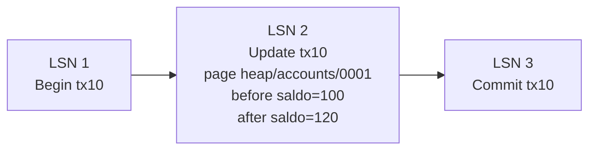

# Write-Ahead Log

> **Estado:** draft.
> **Alcance actual:** representación de registros WAL, LSN, transacción lógica,
> página lógica, imagen antes/después y tipos de operación educativos.
> Append-only log, redo, undo y la regla completa de escribir log antes de
> modificar página quedan para los siguientes pasos del capítulo.

## Por qué existe

Write-Ahead Log existe porque una base de datos no puede confiar solo en el
estado final de sus páginas. Si el proceso cae a mitad de una escritura, el
motor necesita una historia ordenada para responder dos preguntas:

- qué cambios confirmados deben rehacerse;
- qué cambios incompletos deben deshacerse.

La idea central es escribir primero una descripción durable del cambio y
después modificar la página de datos. Por eso se llama *write-ahead*: el log va
delante de la página.

Este primer paso no implementa todavía un archivo append-only ni recovery. Solo
fija el vocabulario mínimo para que los siguientes pasos no mezclen conceptos.

## Modelo mental

```text
LSN 1: begin tx10
LSN 2: update tx10 page heap/accounts/0001 before saldo=100 after saldo=120
LSN 3: commit tx10
```

El WAL no guarda "un comentario". Guarda una secuencia ordenada de registros
con suficiente información para reconstruir decisiones después de una falla.

## Modelo Rust actual

El módulo `src/wal.rs` expone estos tipos:

| Tipo | Responsabilidad |
|------|-----------------|
| `LogSequenceNumber` | Posición lógica de un registro WAL. |
| `WalTransactionId` | Transacción lógica asociada a un registro. |
| `PageId` | Página lógica afectada por una actualización. |
| `PageImage` | Imagen educativa antes o después del cambio. |
| `LogOperation` | Operación registrada: `Begin`, `Update`, `Commit`, `Rollback`. |
| `LogRecord` | Registro WAL con LSN, transacción y operación. |
| `WalError` | Errores de representación del modelo WAL. |

El modelo usa texto para representar imágenes de página. Es deliberado: el
capítulo no intenta enseñar todavía layout físico, checksums, buffers ni I/O.
Primero se necesita una unidad clara de historia.

## Invariantes

El modelo actual defiende estas reglas:

- `PageId` no acepta texto vacío después de recortar espacios;
- `PageImage` no acepta texto vacío después de recortar espacios;
- una operación `Update` requiere una imagen `before` y una imagen `after`
  distintas;
- un registro WAL siempre tiene LSN, transacción y operación;
- solo `Update` es redoable y undoable en este modelo inicial;
- `Begin`, `Commit` y `Rollback` nombran transiciones, pero no contienen delta
  de página.

## Diagrama



El diagrama muestra una historia, no un estado final. Esa distinción prepara el
terreno para redo y undo: `after` permite rehacer, `before` permite deshacer.

## Ejemplo básico

```rust
use rust_database_internals::wal::{
    LogOperation, LogRecord, LogSequenceNumber, PageId, PageImage,
    WalTransactionId,
};

let page_id = PageId::new("heap/accounts/0001")?;
let before = PageImage::new("saldo=100")?;
let after = PageImage::new("saldo=120")?;
let update = LogOperation::update(page_id, before, after)?;

let record = LogRecord::new(
    LogSequenceNumber::new(2),
    WalTransactionId::new(10),
    update,
);

assert!(record.is_redoable());
assert!(record.is_undoable());
# Ok::<(), rust_database_internals::wal::WalError>(())
```

## Lo que aún no hace

Este borrador todavía no decide:

- cómo se agregan registros a un log append-only;
- cómo se impide insertar un LSN fuera de orden;
- cuándo un registro se considera durable;
- cómo se aplica redo;
- cómo se aplica undo;
- cómo se relaciona la regla WAL con páginas sucias en buffer pool;
- cómo se recupera el sistema después de un crash.

## Siguiente paso natural

El siguiente paso del capítulo es modelar un append-only log: una estructura
que asigne LSN de forma monótona, preserve orden de escritura y permita
recorrer la historia registrada.
