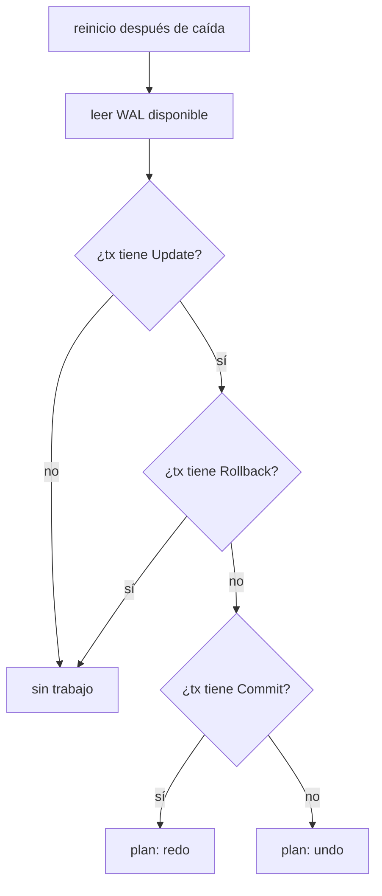

# Recovery

> **Estado:** draft.
> **Alcance actual:** plan educativo de recovery para distinguir transacciones
> confirmadas que requieren redo y transacciones con cambios no confirmados que
> requieren undo después de una caída. Todavía no ejecuta replay del WAL ni
> modela checkpoints.

## Por qué existe

Recovery existe porque una base de datos no controla cuándo se apaga el mundo.
El proceso puede caer después de escribir el WAL, antes de escribir una página,
después de escribir una página, antes de confirmar una transacción o justo
después de confirmarla.

El motor necesita contestar una pregunta al reiniciar:

```text
con la historia que quedó en WAL, ¿qué cambios debo rehacer y cuáles debo
deshacer?
```

Write-Ahead Log guardó la historia. Recovery la interpreta.

## Modelo mental

Dos caídas muy distintas pueden verse parecidas si solo se mira la página:

```text
crash antes de commit:
LSN 1 begin tx10
LSN 2 update tx10 page accounts before saldo=100 after saldo=120

decisión: tx10 no confirmó; sus cambios deben deshacerse.

crash después de commit:
LSN 1 begin tx10
LSN 2 update tx10 page accounts before saldo=100 after saldo=120
LSN 3 commit tx10

decisión: tx10 confirmó; sus cambios deben rehacerse si no llegaron a página.
```

El punto sutil es que recovery no parte de lo que "parece" estar en memoria.
Parte de la historia durable disponible en WAL.

## Modelo Rust actual

El módulo `src/recovery.rs` expone `RecoveryPlan`.

| Tipo | Responsabilidad |
|------|-----------------|
| `RecoveryPlan` | Clasifica transacciones del WAL como candidatas a redo o undo. |

`RecoveryPlan::from_wal` recorre un `WriteAheadLog` y construye dos listas:

- `redo_transactions`: transacciones con cambios y registro `Commit`;
- `undo_transactions`: transacciones con cambios, pero sin `Commit` ni
  `Rollback` al momento de la caída.

Una transacción abierta sin cambios no necesita undo. Una transacción con
`Rollback` ya no se rehace ni se deshace otra vez en este modelo.

## Invariantes

- una transacción con `Update` y sin `Commit` requiere undo;
- una transacción con `Update` y `Commit` requiere redo;
- una transacción sin cambios no requiere trabajo de recovery;
- una transacción con `Rollback` no queda como candidata a redo ni a undo;
- el plan mantiene un orden estable por identificador de transacción;
- el plan no modifica páginas: solo decide qué tipo de trabajo corresponde.

## Diagrama



## Ejemplo básico

```rust
use rust_database_internals::{
    recovery::RecoveryPlan,
    wal::{LogOperation, PageId, PageImage, WalTransactionId, WriteAheadLog},
};

let mut log = WriteAheadLog::new();
let tx = WalTransactionId::new(10);

log.append_begin(tx);
log.append(
    tx,
    LogOperation::update(
        PageId::new("heap/accounts/0001")?,
        PageImage::new("saldo=100")?,
        PageImage::new("saldo=120")?,
    )?,
);

let before_commit = RecoveryPlan::from_wal(&log);
assert!(before_commit.requires_undo(tx));
assert!(!before_commit.requires_redo(tx));

log.append_commit(tx);

let after_commit = RecoveryPlan::from_wal(&log);
assert!(after_commit.requires_redo(tx));
assert!(!after_commit.requires_undo(tx));
# Ok::<(), rust_database_internals::wal::WalError>(())
```

Ejemplo ejecutable: `cargo run --example recovery_crash_commit`.

## Lo que aún no hace

Este borrador todavía no decide:

- cómo aplicar redo y undo sobre páginas;
- cómo recorrer el WAL en orden de recovery real;
- cómo separar análisis, redo y undo;
- cómo usar checkpoints para no leer toda la historia desde el inicio;
- cómo distinguir durabilidad física mediante disco, `fsync` o buffer pool.

## Siguiente paso natural

El siguiente paso del capítulo es modelar replay del WAL: convertir el plan de
recovery en cambios observables sobre `PageStore`.
