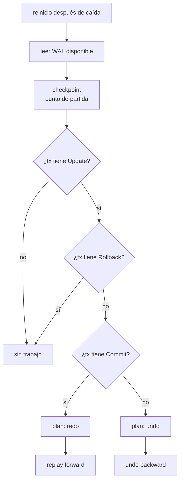

# Recovery

> **Estado:** benchmarked.
> **Alcance actual:** plan educativo de recovery para distinguir transacciones
> confirmadas que requieren redo y transacciones con cambios no confirmados que
> requieren undo después de una caída. Incluye replay educativo del WAL sobre
> `PageStore`, ejercicios, soluciones, diagrama Mermaid, benchmark manual y
> documentación conceptual de checkpoints.

## Por qué existe

Recovery existe porque una base de datos no controla cuándo se apaga el mundo.
El proceso puede caer después de escribir el WAL, antes de escribir una página,
después de escribir una página, antes de confirmar una transacción o justo
después de confirmarla.

El motor necesita contestar una pregunta al reiniciar:

```text
con la historia que quedó en WAL, ¿qué cambios debo rehacer y cuáles debo
deshacer?
```

Write-Ahead Log guardó la historia. Recovery la interpreta.

## Modelo mental

Dos caídas muy distintas pueden verse parecidas si solo se mira la página:

```text
crash antes de commit:
LSN 1 begin tx10
LSN 2 update tx10 page accounts before saldo=100 after saldo=120

decisión: tx10 no confirmó; sus cambios deben deshacerse.

crash después de commit:
LSN 1 begin tx10
LSN 2 update tx10 page accounts before saldo=100 after saldo=120
LSN 3 commit tx10

decisión: tx10 confirmó; sus cambios deben rehacerse si no llegaron a página.
```

El punto sutil es que recovery no parte de lo que "parece" estar en memoria.
Parte de la historia durable disponible en WAL.

## Modelo Rust actual

El módulo `src/recovery.rs` expone `RecoveryPlan` y `RecoveryReport`.

| Tipo | Responsabilidad |
|------|-----------------|
| `RecoveryPlan` | Clasifica transacciones del WAL como candidatas a redo o undo. |
| `RecoveryReport` | Resume cuántos registros se rehicieron o deshicieron durante replay. |

`RecoveryPlan::from_wal` recorre un `WriteAheadLog` y construye dos listas:

- `redo_transactions`: transacciones con cambios y registro `Commit`;
- `undo_transactions`: transacciones con cambios, pero sin `Commit` ni
  `Rollback` al momento de la caída.

Una transacción abierta sin cambios no necesita undo. Una transacción con
`Rollback` ya no se rehace ni se deshace otra vez en este modelo.

`RecoveryPlan::replay` aplica ese plan sobre `PageStore`:

- recorre el WAL hacia adelante para redo de transacciones confirmadas;
- recorre el WAL hacia atrás para undo de transacciones no confirmadas;
- devuelve un reporte con conteos de registros aplicados.

Los checkpoints se documentan como frontera conceptual: no cambian qué significa
redo o undo, pero sí cambian desde dónde conviene empezar a leer el WAL durante
recovery.

## Invariantes

- una transacción con `Update` y sin `Commit` requiere undo;
- una transacción con `Update` y `Commit` requiere redo;
- una transacción sin cambios no requiere trabajo de recovery;
- una transacción con `Rollback` no queda como candidata a redo ni a undo;
- el plan mantiene un orden estable por identificador de transacción;
- redo se aplica en orden de WAL;
- undo se aplica en orden inverso de WAL;
- replay solo modifica páginas mediante `PageStore::redo` y `PageStore::undo`;
- un checkpoint no reemplaza al WAL: solo resume un punto útil para acotar la
  recuperación.

## Diagrama



Diagrama fuente: `diagrams/08-recovery.mmd`.

## Ejemplo básico

```rust
use rust_database_internals::{
    recovery::RecoveryPlan,
    wal::{LogOperation, PageId, PageImage, WalTransactionId, WriteAheadLog},
};

let mut log = WriteAheadLog::new();
let tx = WalTransactionId::new(10);

log.append_begin(tx);
log.append(
    tx,
    LogOperation::update(
        PageId::new("heap/accounts/0001")?,
        PageImage::new("saldo=100")?,
        PageImage::new("saldo=120")?,
    )?,
);

let before_commit = RecoveryPlan::from_wal(&log);
assert!(before_commit.requires_undo(tx));
assert!(!before_commit.requires_redo(tx));

log.append_commit(tx);

let after_commit = RecoveryPlan::from_wal(&log);
assert!(after_commit.requires_redo(tx));
assert!(!after_commit.requires_undo(tx));
# Ok::<(), rust_database_internals::wal::WalError>(())
```

Ejemplo ejecutable: `cargo run --example recovery_crash_commit`.

## Replay del WAL

El replay convierte el plan en cambios observables sobre páginas:

```rust
use rust_database_internals::{
    recovery::RecoveryPlan,
    wal::{LogOperation, PageId, PageImage, PageStore, WalTransactionId, WriteAheadLog},
};

let page_id = PageId::new("heap/accounts/0001")?;
let mut log = WriteAheadLog::new();
let tx = WalTransactionId::new(10);

log.append_begin(tx);
log.append(
    tx,
    LogOperation::update(
        page_id.clone(),
        PageImage::new("saldo=100")?,
        PageImage::new("saldo=120")?,
    )?,
);
log.append_commit(tx);

let plan = RecoveryPlan::from_wal(&log);
let mut store = PageStore::new();
store.write(page_id.clone(), PageImage::new("saldo=100")?);

let report = plan.replay(&log, &mut store)?;

assert_eq!(store.read(&page_id), Some(&PageImage::new("saldo=120")?));
assert_eq!(report.redone_records(), 1);
assert_eq!(report.undone_records(), 0);
# Ok::<(), rust_database_internals::wal::WalError>(())
```

Ejemplo ejecutable: `cargo run --example recovery_replay_wal`.

## Ejemplos progresivos

Los ejemplos del capítulo viven en `examples/` y se pueden ejecutar con
`cargo run --example <nombre>`.

| Ejemplo | Propósito |
|---------|-----------|
| `recovery_crash_commit` | Comparar crash antes y después de `Commit`. |
| `recovery_replay_wal` | Aplicar redo y undo sobre un `PageStore` educativo. |

El orden inverso de undo importa cuando una transacción no confirmada modificó
la misma página más de una vez:

```text
LSN 2 before saldo=100 after saldo=120
LSN 3 before saldo=120 after saldo=140

undo correcto:
LSN 3 restaura saldo=120
LSN 2 restaura saldo=100
```

## Checkpoints

Sin checkpoints, un motor ingenuo tendría que leer el WAL desde el primer
registro histórico cada vez que reinicia. Eso funciona en un ejemplo de veinte
líneas, pero no en una base de datos que lleva semanas escribiendo.

Un checkpoint existe para responder:

```text
¿desde qué punto reciente puedo empezar recovery sin olvidar trabajo necesario?
```

La idea no es borrar el WAL de forma imprudente. La idea es registrar un punto
de referencia que dice: hasta aquí el motor conoce cierto estado estable, y a
partir de aquí debe analizar lo que pudo quedar pendiente.

Un checkpoint educativo puede resumir:

- el último LSN considerado estable;
- transacciones activas al momento del checkpoint;
- páginas sucias que todavía podrían necesitar escribirse;
- el LSN más antiguo que recovery no debe olvidar.

```text
LSN 10 checkpoint
  active tx: tx20
  dirty pages:
    heap/accounts/0001 desde LSN 7
    heap/payments/0004 desde LSN 9

recovery no empieza en LSN 1;
empieza en el punto más antiguo que el checkpoint todavía necesita explicar.
```

El checkpoint permite leer menos historia, pero no elimina las preguntas de
recovery:

- ¿qué transacciones confirmadas necesitan redo?
- ¿qué transacciones no confirmadas necesitan undo?
- ¿qué páginas pudieron quedar atrasadas respecto al WAL?

### Checkpoint nítido y checkpoint difuso

Un checkpoint nítido pausa el mundo, fuerza páginas y escribe un punto limpio.
Es fácil de razonar, pero caro: detener todo para crear orden perfecto suele
lastimar disponibilidad y latencia.

Un checkpoint difuso permite que el sistema siga trabajando mientras registra
un resumen suficientemente útil. Es más realista, pero obliga a guardar más
metadatos: páginas sucias, transacciones activas y LSNs de inicio relevantes.

```text
checkpoint nítido:
pausar escrituras -> forzar páginas -> escribir checkpoint -> continuar

checkpoint difuso:
marcar inicio -> seguir trabajando -> registrar páginas/tx activas -> cerrar
checkpoint
```

Este curso no implementa todavía una estructura `Checkpoint`. Lo importante en
este capítulo es fijar el contrato mental: checkpoint no significa "ya no hay
recovery"; significa "recovery puede empezar desde un punto más inteligente".

## Ejercicios

Los ejercicios refuerzan la lectura del WAL como historia durable. Primero se
clasifica una transacción, después se rehace una confirmada y finalmente se
deshace una incompleta en orden inverso.

### Nivel 1: Clasificar crash antes y después de commit

Construye un WAL con `Begin` y `Update` para `tx10`. Antes de agregar `Commit`,
crea un `RecoveryPlan`; después agrega `Commit` y crea otro plan.

La solución debe demostrar:

- que antes de `Commit` la transacción requiere undo;
- que después de `Commit` la transacción requiere redo;
- que una transacción no debe aparecer en ambas listas al mismo tiempo.

Solución ejecutable:

```bash
cargo run --example recovery_classify_crash
```

### Nivel 2: Rehacer una transacción confirmada

Construye una transacción confirmada que cambia `saldo=100` a `saldo=120`.
Inicializa `PageStore` con `saldo=100` y ejecuta `RecoveryPlan::replay`.

La solución debe demostrar:

- que el plan clasifica la transacción para redo;
- que replay aplica la imagen `after`;
- que `RecoveryReport` registra un redo y cero undo.

Solución ejecutable:

```bash
cargo run --example recovery_replay_redo
```

### Nivel 3: Undo en orden inverso

Construye una transacción no confirmada con dos updates sobre la misma página:
`saldo=100 -> saldo=120` y `saldo=120 -> saldo=140`. Inicializa `PageStore`
con `saldo=140` y ejecuta replay.

La solución debe mostrar que:

- la transacción incompleta requiere undo;
- undo recorre el WAL hacia atrás;
- el saldo final vuelve a `saldo=100`;
- `RecoveryReport` registra cero redo y dos undo.

Solución ejecutable:

```bash
cargo run --example recovery_undo_reverse
```

## Benchmark manual

El benchmark del capítulo mide operaciones pequeñas y deliberadas:

- análisis del WAL para construir `RecoveryPlan`;
- replay con transacciones confirmadas;
- replay con transacciones incompletas;
- replay mixto con redo y undo.

Ejecutar:

```bash
cargo bench --bench recovery_bench
```

El objetivo no es medir recovery real sobre disco. La medición conecta la regla
conceptual con costos observables del modelo: analizar historia, recorrer hacia
adelante para redo y recorrer hacia atrás para undo.

## Lo que aún no hace

Este capítulo todavía no decide:

- cómo separar análisis, redo y undo;
- cómo implementar una estructura ejecutable de checkpoints;
- cómo distinguir durabilidad física mediante disco, `fsync` o buffer pool.

## Siguiente paso natural

El siguiente capítulo natural es Replicación: modelar primary/replica, lag y
confirmación síncrona o asíncrona.
