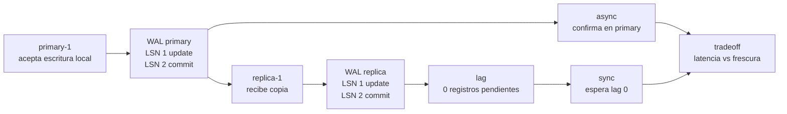

# Replicación

> **Estado:** tested.
> **Alcance actual:** modelo educativo primary/replica. Solo el primary acepta
> escrituras locales; las réplicas reciben copias ordenadas del WAL del primary.
> Incluye medición educativa de lag por registros pendientes y últimos LSNs.
> También modela confirmación asíncrona y síncrona, y documenta tradeoffs de
> consistencia.

## Por qué existe

Replicación existe porque una sola copia de los datos es un punto frágil. Si el
primary cae, si una máquina se pierde o si una región queda inaccesible, el
sistema necesita otra copia suficientemente cercana para seguir razonando.

El precio es que ahora ya no basta preguntar "¿cuál es el estado?". También hay
que preguntar:

- ¿qué nodo aceptó la escritura?
- ¿qué réplicas ya recibieron ese cambio?
- ¿qué tan atrasada está cada réplica?
- ¿cuándo se considera confirmada una escritura?

Este primer paso solo fija el vocabulario: primary, replica y copia ordenada de
registros. El segundo paso agrega lag: una forma explícita de medir qué tan
lejos está una réplica del WAL del primary. El tercer paso modela confirmación:
cuándo una escritura se considera aceptada. El cuarto paso nombra el costo:
cada decisión mueve el sistema entre latencia, disponibilidad y frescura de
lecturas.

## Modelo mental

```text
primary-1
  WAL: LSN 1 update tx10 saldo=100 -> saldo=120
       LSN 2 commit tx10

replica-1
  WAL: copia LSN 1
       copia LSN 2
```

La réplica no inventa escrituras locales. Sigue al primary copiando su historia
en el mismo orden lógico.

## Modelo Rust actual

El módulo `src/replication.rs` expone estos tipos:

| Tipo | Responsabilidad |
|------|-----------------|
| `ReplicationRole` | Rol del nodo: `Primary` o `Replica`. |
| `ReplicationNode` | Nodo con identificador, rol y WAL local. |
| `ReplicationCluster` | Conjunto educativo con un primary y réplicas. |
| `ReplicationAckMode` | Modo de confirmación: `Async` o `Sync`. |
| `ReplicationDecision` | Decisión de confirmación: confirmada o esperando réplicas. |
| `ReplicationLag` | Atraso observable de una réplica respecto al primary. |
| `ReplicationReport` | Resultado de copiar registros hacia una réplica. |
| `ReplicationError` | Errores del modelo de replicación. |

El primary puede agregar operaciones locales al WAL. Una réplica rechaza
escrituras locales porque, en este modelo, su trabajo es recibir la historia del
primary.

`ReplicationCluster::replica_lag` compara el WAL del primary con el WAL de una
réplica. En este modelo, lag significa registros pendientes de copiar:

```text
primary tiene 2 registros
replica tiene 0 registros
lag = 2 registros pendientes
```

`ReplicationCluster::confirm_write` modela dos políticas:

- `Async`: confirma cuando el primary aceptó la escritura;
- `Sync`: confirma solo cuando las réplicas conocidas están al día.

Los tradeoffs de consistencia se documentan como decisiones de lectura y
confirmación. Este capítulo no implementa failover, quorum ni consenso; fija el
mapa conceptual que esos sistemas expanden.

## Invariantes

- un identificador de nodo no puede estar vacío;
- solo un nodo con rol `Primary` acepta escrituras locales;
- un nodo con rol `Replica` rechaza escrituras locales;
- un cluster tiene exactamente un primary explícito;
- la lista de réplicas solo acepta nodos con rol `Replica`;
- los identificadores de nodos dentro del cluster no se repiten;
- la copia hacia una réplica preserva el orden de LSN del primary;
- el lag baja cuando la réplica copia registros del primary;
- una réplica está al día cuando su número de registros coincide con el del
  primary;
- confirmación asíncrona no espera a las réplicas;
- confirmación síncrona espera si alguna réplica tiene registros pendientes;
- leer desde una réplica puede devolver una vista atrasada si existe lag;
- leer desde el primary favorece frescura, pero concentra carga en el primary.

## Diagrama



## Ejemplo básico

```rust
use rust_database_internals::{
    replication::{ReplicationCluster, ReplicationNode},
    wal::{LogOperation, PageId, PageImage, WalTransactionId},
};

let mut primary = ReplicationNode::primary("primary-1")?;
let tx = WalTransactionId::new(10);

primary.append_local_update(
    tx,
    LogOperation::update(
        PageId::new("heap/accounts/0001")?,
        PageImage::new("saldo=100")?,
        PageImage::new("saldo=120")?,
    )?,
)?;
primary.append_local_commit(tx)?;

let replica = ReplicationNode::replica("replica-1")?;
let mut cluster = ReplicationCluster::new(primary, vec![replica])?;

let report = cluster.replicate_to("replica-1")?;

assert_eq!(report.copied_records(), 2);
assert_eq!(
    cluster.replica("replica-1").expect("réplica").log().last_lsn(),
    cluster.primary().log().last_lsn()
);
# Ok::<(), rust_database_internals::replication::ReplicationError>(())
```

Ejemplo ejecutable: `cargo run --example replication_primary_replica`.

## Lag

Lag nombra la distancia entre lo que el primary ya conoce y lo que una réplica
ha recibido.

```rust
use rust_database_internals::{
    replication::{ReplicationCluster, ReplicationNode},
    wal::{LogOperation, PageId, PageImage, WalTransactionId},
};

let mut primary = ReplicationNode::primary("primary-1")?;
let tx = WalTransactionId::new(10);

primary.append_local_update(
    tx,
    LogOperation::update(
        PageId::new("heap/accounts/0001")?,
        PageImage::new("saldo=100")?,
        PageImage::new("saldo=120")?,
    )?,
)?;
primary.append_local_commit(tx)?;

let replica = ReplicationNode::replica("replica-1")?;
let mut cluster = ReplicationCluster::new(primary, vec![replica])?;

let before = cluster.replica_lag("replica-1")?;
assert_eq!(before.pending_records(), 2);
assert!(!before.is_caught_up());

cluster.replicate_to("replica-1")?;

let after = cluster.replica_lag("replica-1")?;
assert_eq!(after.pending_records(), 0);
assert!(after.is_caught_up());
# Ok::<(), rust_database_internals::replication::ReplicationError>(())
```

Ejemplo ejecutable: `cargo run --example replication_lag`.

## Confirmación

Confirmar una escritura no siempre significa lo mismo. En modo asíncrono, el
primary responde en cuanto acepta la escritura local. En modo síncrono, el
primary espera que las réplicas conocidas alcancen su WAL.

```rust
use rust_database_internals::{
    replication::{
        ReplicationAckMode, ReplicationCluster, ReplicationDecision,
        ReplicationNode,
    },
    wal::{LogOperation, PageId, PageImage, WalTransactionId},
};

let mut primary = ReplicationNode::primary("primary-1")?;
let tx = WalTransactionId::new(10);

primary.append_local_update(
    tx,
    LogOperation::update(
        PageId::new("heap/accounts/0001")?,
        PageImage::new("saldo=100")?,
        PageImage::new("saldo=120")?,
    )?,
)?;
primary.append_local_commit(tx)?;

let replica = ReplicationNode::replica("replica-1")?;
let mut cluster = ReplicationCluster::new(primary, vec![replica])?;

assert_eq!(
    cluster.confirm_write(ReplicationAckMode::Async)?,
    ReplicationDecision::Confirmed
);
assert_eq!(
    cluster.confirm_write(ReplicationAckMode::Sync)?,
    ReplicationDecision::WaitingForReplicas {
        pending_replicas: 1,
        pending_records: 2,
    }
);

cluster.replicate_to("replica-1")?;

assert_eq!(
    cluster.confirm_write(ReplicationAckMode::Sync)?,
    ReplicationDecision::Confirmed
);
# Ok::<(), rust_database_internals::replication::ReplicationError>(())
```

Ejemplo ejecutable: `cargo run --example replication_ack_modes`.

## Tradeoffs de consistencia

Replicación no elimina decisiones difíciles. Las mueve a preguntas más
explícitas:

- ¿confirmo rápido o espero a las réplicas?
- ¿leo desde el primary o desde una réplica?
- ¿acepto una lectura posiblemente atrasada a cambio de menos carga?
- ¿prefiero latencia baja o una historia más fresca?

### Confirmación asíncrona

En confirmación asíncrona, el primary responde cuando aceptó la escritura
localmente. Es rápida, pero una réplica puede seguir atrasada:

```text
primary:
  LSN 1 update
  LSN 2 commit

replica:
  sin LSN 1 ni LSN 2 todavía

cliente:
  recibe "confirmado" aunque la réplica tenga lag
```

El beneficio es menor latencia. El costo es que una lectura desde réplica puede
no ver todavía la escritura recién confirmada.

### Confirmación síncrona

En confirmación síncrona, el primary espera que las réplicas conocidas alcancen
su WAL antes de confirmar:

```text
primary:
  LSN 1 update
  LSN 2 commit

replica:
  copia LSN 1
  copia LSN 2

cliente:
  recibe "confirmado" después de que la réplica alcanza al primary
```

El beneficio es una historia más fresca en réplicas. El costo es más latencia y
menor tolerancia a réplicas lentas.

### Lecturas desde primary y lecturas desde réplicas

Leer desde el primary favorece frescura: el cliente observa la historia que el
nodo escritor ya aceptó. Leer desde una réplica distribuye carga, pero puede
ver una versión atrasada si hay lag.

| Decisión | Beneficio | Costo |
|----------|-----------|-------|
| Confirmación asíncrona | baja latencia de escritura | réplicas pueden ir atrasadas |
| Confirmación síncrona | réplicas más frescas | mayor latencia de escritura |
| Leer desde primary | lectura fresca | más carga en el primary |
| Leer desde réplica | reparte carga de lectura | lectura puede ser stale |

Este modelo no intenta resolver consenso. Solo enseña la tensión base: más
frescura suele costar latencia o disponibilidad; más velocidad suele aceptar
algún grado de atraso observable.

## Lo que aún no hace

Este capítulo todavía no decide:

- qué ocurre si una réplica pierde registros;
- cómo elegir un nuevo primary;
- cómo implementar quorum, consenso o failover automático.

## Siguiente paso natural

El siguiente capítulo natural es Query Optimizer: diseñar una representación
mínima de plan lógico y físico.
