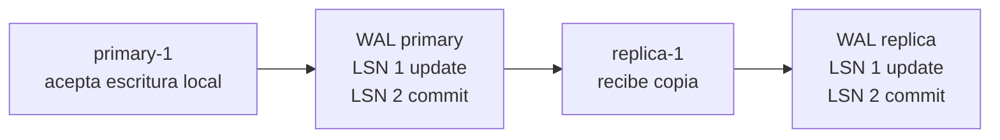

# Replicación

> **Estado:** draft.
> **Alcance actual:** modelo educativo primary/replica. Solo el primary acepta
> escrituras locales; las réplicas reciben copias ordenadas del WAL del primary.
> Todavía no modela lag, confirmación síncrona/asíncrona ni tradeoffs de
> consistencia.

## Por qué existe

Replicación existe porque una sola copia de los datos es un punto frágil. Si el
primary cae, si una máquina se pierde o si una región queda inaccesible, el
sistema necesita otra copia suficientemente cercana para seguir razonando.

El precio es que ahora ya no basta preguntar "¿cuál es el estado?". También hay
que preguntar:

- ¿qué nodo aceptó la escritura?
- ¿qué réplicas ya recibieron ese cambio?
- ¿qué tan atrasada está cada réplica?
- ¿cuándo se considera confirmada una escritura?

Este primer paso solo fija el vocabulario: primary, replica y copia ordenada de
registros.

## Modelo mental

```text
primary-1
  WAL: LSN 1 update tx10 saldo=100 -> saldo=120
       LSN 2 commit tx10

replica-1
  WAL: copia LSN 1
       copia LSN 2
```

La réplica no inventa escrituras locales. Sigue al primary copiando su historia
en el mismo orden lógico.

## Modelo Rust actual

El módulo `src/replication.rs` expone estos tipos:

| Tipo | Responsabilidad |
|------|-----------------|
| `ReplicationRole` | Rol del nodo: `Primary` o `Replica`. |
| `ReplicationNode` | Nodo con identificador, rol y WAL local. |
| `ReplicationCluster` | Conjunto educativo con un primary y réplicas. |
| `ReplicationReport` | Resultado de copiar registros hacia una réplica. |
| `ReplicationError` | Errores del modelo de replicación. |

El primary puede agregar operaciones locales al WAL. Una réplica rechaza
escrituras locales porque, en este modelo, su trabajo es recibir la historia del
primary.

## Invariantes

- un identificador de nodo no puede estar vacío;
- solo un nodo con rol `Primary` acepta escrituras locales;
- un nodo con rol `Replica` rechaza escrituras locales;
- un cluster tiene exactamente un primary explícito;
- la lista de réplicas solo acepta nodos con rol `Replica`;
- los identificadores de nodos dentro del cluster no se repiten;
- la copia hacia una réplica preserva el orden de LSN del primary.

## Diagrama



## Ejemplo básico

```rust
use rust_database_internals::{
    replication::{ReplicationCluster, ReplicationNode},
    wal::{LogOperation, PageId, PageImage, WalTransactionId},
};

let mut primary = ReplicationNode::primary("primary-1")?;
let tx = WalTransactionId::new(10);

primary.append_local_update(
    tx,
    LogOperation::update(
        PageId::new("heap/accounts/0001")?,
        PageImage::new("saldo=100")?,
        PageImage::new("saldo=120")?,
    )?,
)?;
primary.append_local_commit(tx)?;

let replica = ReplicationNode::replica("replica-1")?;
let mut cluster = ReplicationCluster::new(primary, vec![replica])?;

let report = cluster.replicate_to("replica-1")?;

assert_eq!(report.copied_records(), 2);
assert_eq!(
    cluster.replica("replica-1").expect("réplica").log().last_lsn(),
    cluster.primary().log().last_lsn()
);
# Ok::<(), rust_database_internals::replication::ReplicationError>(())
```

Ejemplo ejecutable: `cargo run --example replication_primary_replica`.

## Lo que aún no hace

Este borrador todavía no decide:

- cómo medir lag;
- cómo confirmar escrituras de forma síncrona o asíncrona;
- qué ocurre si una réplica pierde registros;
- cómo elegir un nuevo primary;
- cómo razonar sobre consistencia de lecturas desde réplicas.

## Siguiente paso natural

El siguiente paso del capítulo es modelar lag: hacer visible cuántos registros
o LSNs separan a una réplica del primary.
