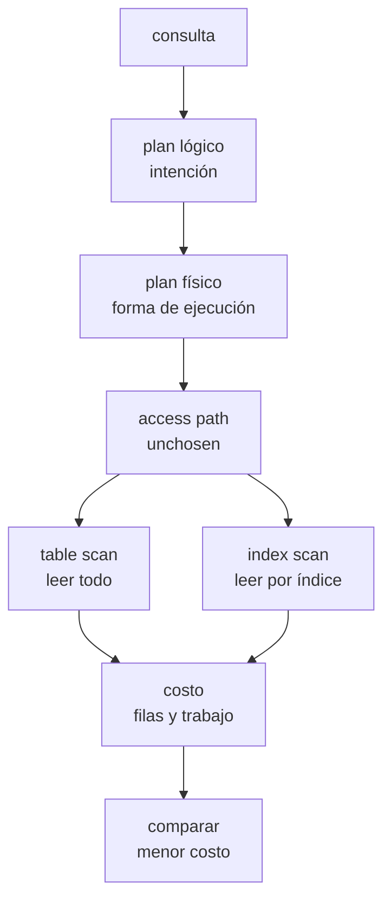

# Query Optimizer

> **Estado:** draft.
> **Alcance actual:** representación educativa de plan lógico y plan físico.
> Incluye table scan, index scan y estimación de costo. Todavía no documenta la
> relación con `EXPLAIN`.

## Por qué existe

Un motor de base de datos no ejecuta una consulta directamente desde el texto
SQL. Primero necesita representarla como una intención y después convertir esa
intención en una forma concreta de ejecución.

La separación importa porque dos consultas con la misma intención pueden
ejecutarse de maneras distintas:

```text
intención:
  dame id y balance de accounts donde status = active

posibles ejecuciones futuras:
  leer toda la tabla y filtrar
  usar un índice por status y luego proyectar columnas
```

Este primer paso del capítulo no decide cuál ejecución conviene. Solo crea el
vocabulario para distinguir:

- qué quiere la consulta;
- cómo podría ejecutarse;
- qué decisiones todavía no ha tomado el optimizador.

## Modelo mental

El plan lógico representa la intención:

```text
Project(id, balance)
  Select(status = active)
    ReadRelation(accounts)
```

El plan físico representa una forma de ejecución:

```text
Project(id)
  Filter(status = active)
    ReadRelation(accounts, access_path = table_scan)

Project(id)
  Filter(status = active)
    ReadRelation(accounts, access_path = index_scan(idx_accounts_status, status))
```

La diferencia parece pequeña, pero es fundamental. El plan lógico dice "quiero
estas columnas y este filtro". El plan físico empieza a hablar de ejecución:
operadores, orden de trabajo y ruta de acceso. En este punto ya puede nombrar
table scan e index scan, y compararlos con un costo estimado.

## Modelo Rust actual

El módulo `src/query_optimizer.rs` expone nombres, predicados y dos árboles de
plan.

| Tipo | Responsabilidad |
|------|-----------------|
| `RelationName` | Nombre validado de una relación consultable. |
| `ColumnName` | Nombre validado de una columna. |
| `IndexName` | Nombre validado de un índice disponible. |
| `Literal` | Valor literal usado en predicados. |
| `ComparisonOperator` | Operador de comparación educativo. |
| `Predicate` | Comparación entre columna, operador y literal. |
| `LogicalPlan` | Árbol de intención de consulta. |
| `PhysicalPlan` | Árbol de forma de ejecución. |
| `PhysicalAccessPath` | Ruta de acceso física elegida o pendiente de elegir. |
| `CostCatalog` | Estadísticas mínimas de relaciones e índices. |
| `RelationStatistics` | Conteo de filas de una relación. |
| `IndexStatistics` | Selectividad de un índice. |
| `PlanCost` | Filas leídas, filas producidas y unidades de trabajo. |

`PhysicalAccessPath` reconoce tres estados:

- `Unchosen`: el optimizador todavía no elige una ruta;
- `TableScan`: leer toda la relación;
- `IndexScan`: leer mediante un índice nombrado y una columna de búsqueda.

La estimación de costo usa reglas deliberadamente pequeñas:

- table scan lee todas las filas de la relación;
- index scan lee las filas estimadas por selectividad;
- index scan suma un costo fijo de búsqueda de índice;
- el plan más barato es el de menor número de unidades de trabajo.

## Invariantes

- un nombre de relación no puede estar vacío;
- un nombre de columna no puede estar vacío;
- un nombre de índice no puede estar vacío;
- una proyección debe pedir al menos una columna;
- un plan lógico `Select` o `Project` envuelve exactamente un hijo;
- un plan físico `Filter` o `Project` envuelve exactamente un hijo;
- `PhysicalAccessPath::Unchosen` significa que el optimizador aún no eligió
  table scan ni index scan;
- un index scan siempre nombra el índice usado y la columna de búsqueda;
- la selectividad de un índice debe estar entre 0 y 10_000 puntos base;
- una ruta `Unchosen` no puede estimarse hasta elegir una alternativa física.

## Diagrama



## Ejemplo básico

```rust
use rust_database_internals::query_optimizer::{
    ColumnName, ComparisonOperator, Literal, LogicalPlan, Predicate, RelationName,
};

let plan = LogicalPlan::relation(RelationName::new("accounts")?)
    .select(Predicate::comparison(
        ColumnName::new("status")?,
        ComparisonOperator::Eq,
        Literal::text("active"),
    ))
    .project(vec![
        ColumnName::new("id")?,
        ColumnName::new("balance")?,
    ])?;

assert_eq!(plan.children().len(), 1);
# Ok::<(), rust_database_internals::query_optimizer::QueryOptimizerError>(())
```

## Table scan e index scan

Un table scan representa la opción más directa: leer toda la relación y dejar
que filtros posteriores descarten filas.

```rust
use rust_database_internals::query_optimizer::{
    PhysicalAccessPath, PhysicalOperation, PhysicalPlan, RelationName,
};

let relation = RelationName::new("accounts")?;
let plan = PhysicalPlan::table_scan(relation.clone());

assert_eq!(
    plan.operation(),
    &PhysicalOperation::ReadRelation {
        relation,
        access_path: PhysicalAccessPath::TableScan,
    }
);
# Ok::<(), rust_database_internals::query_optimizer::QueryOptimizerError>(())
```

Un index scan representa una ruta de acceso más específica: usar un índice
nombrado para buscar por una columna.

```rust
use rust_database_internals::query_optimizer::{
    ColumnName, IndexName, PhysicalAccessPath, PhysicalPlan, PhysicalOperation, RelationName,
};

let relation = RelationName::new("accounts")?;
let index = IndexName::new("idx_accounts_status")?;
let lookup_column = ColumnName::new("status")?;
let plan = PhysicalPlan::index_scan(relation.clone(), index.clone(), lookup_column.clone());

assert_eq!(
    plan.operation(),
    &PhysicalOperation::ReadRelation {
        relation,
        access_path: PhysicalAccessPath::IndexScan {
            index,
            lookup_column,
        },
    }
);
# Ok::<(), rust_database_internals::query_optimizer::QueryOptimizerError>(())
```

## Estimación de costo

La estimación no intenta predecir un motor real. Sirve para practicar la idea
central: un optimizador compara alternativas usando estadísticas.

```rust
use rust_database_internals::query_optimizer::{
    ColumnName, CostCatalog, IndexName, IndexStatistics, PhysicalPlan, RelationName,
    RelationStatistics, RowCount, Selectivity,
};

let relation = RelationName::new("accounts")?;
let index = IndexName::new("idx_accounts_status")?;
let catalog = CostCatalog::new(vec![RelationStatistics::new(
    relation.clone(),
    RowCount::new(10_000),
)])
.with_indexes(vec![IndexStatistics::new(
    index.clone(),
    Selectivity::new_basis_points(500)?,
)]);

let table_scan = PhysicalPlan::table_scan(relation.clone());
let index_scan = PhysicalPlan::index_scan(
    relation,
    index,
    ColumnName::new("status")?,
);

let table_cost = table_scan.estimate_cost(&catalog)?;
let index_cost = index_scan.estimate_cost(&catalog)?;

assert_eq!(table_cost.work_units(), 10_000);
assert_eq!(index_cost.work_units(), 510);
assert!(index_cost.is_cheaper_than(&table_cost));
# Ok::<(), rust_database_internals::query_optimizer::QueryOptimizerError>(())
```

## Lo que aún no hace

Este borrador todavía no decide:

- cómo explicar una decisión con una salida similar a `EXPLAIN`.

## Siguiente paso natural

El siguiente paso del capítulo es documentar por qué `EXPLAIN` existe en
motores reales y cerrar ejemplos, ejercicios y benchmark del capítulo.
